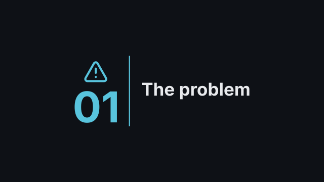
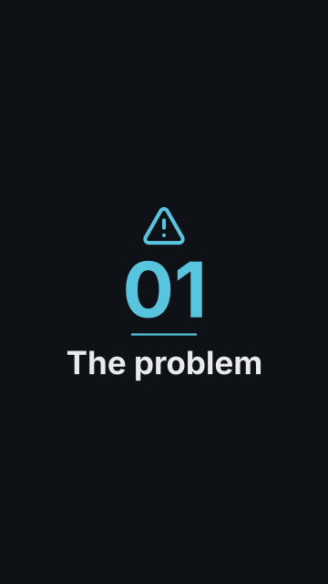
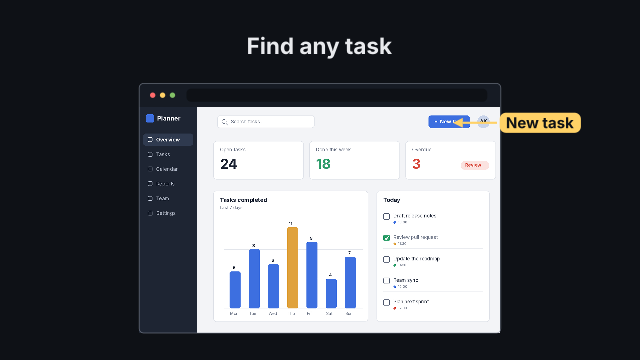
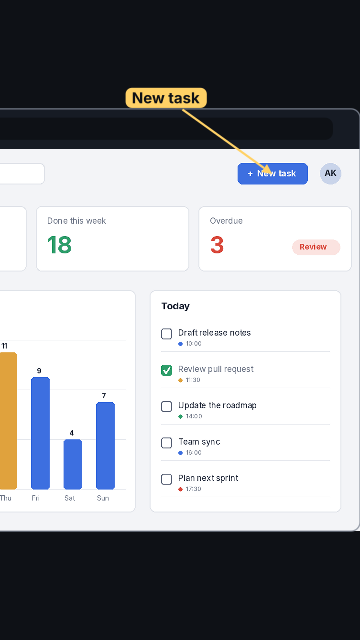
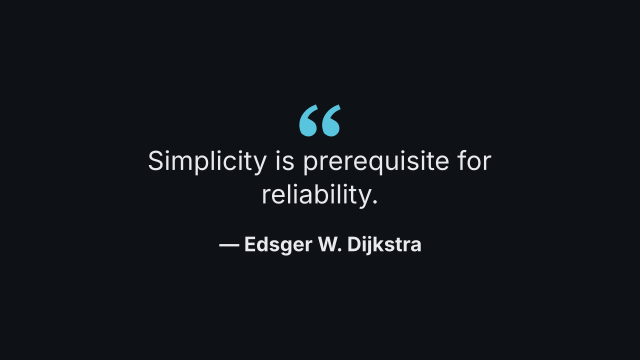
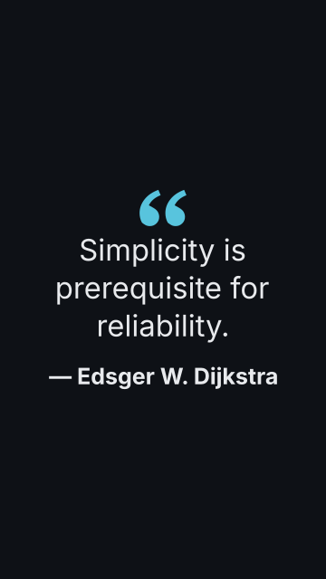

# Scene gallery

<!-- Generated by `vidgen gallery`; do not edit. -->

Every vidgen scene type, rendered from its sample in the author guide (`AGENTS.md`,
`vidgen guide scenes`): the last beat at 16:9 and 9:16; each page has the YAML, the
params, the action targets and a GIF of the whole scene. Regenerate with `vidgen gallery`.

## Text and structure

| type | stills | use it for |
|---|---|---|
| [`title`](title.md) |  | the title, who made it |
| [`chapter`](chapter.md) |  | a new section |
| [`text_card`](text_card.md) |  | one statement or question, big |
| [`bullets`](bullets.md) |  | a few points, in order |
| [`icon_grid`](icon_grid.md) |  | a set of things (features, parts, options) |
| [`comparison`](comparison.md) |  | A vs B, before / after, pros / cons |
| [`table`](table.md) |  | exact values to compare across attributes |
| [`timeline`](timeline.md) |  | what happened when |
| [`end_card`](end_card.md) |  | thanks, links, call to action |

## Flows

| type | stills | use it for |
|---|---|---|
| [`diagram`](diagram.md) |  | how parts connect, decisions, architecture |
| `flowchart` | same type as [`diagram`](diagram.md) | how parts connect, decisions, architecture |
| [`process`](process.md) |  | something moving through stages |
| [`network`](network.md) |  | a neural network |

## Data

| type | stills | use it for |
|---|---|---|
| [`stat`](stat.md) |  | one number that matters |
| [`bar_chart`](bar_chart.md) |  | categories compared by size |
| [`line_chart`](line_chart.md) |  | change over time, trends |
| [`scatter`](scatter.md) |  | a relationship between two measures |
| [`histogram`](histogram.md) |  | how values are distributed |
| [`pie`](pie.md) |  | parts of a whole (≤ 6 parts) |
| [`heatmap`](heatmap.md) |  | a matrix (correlations, hours x days) |
| [`map`](map.md) |  | where in the world |

## Pictures and media

| type | stills | use it for |
|---|---|---|
| [`image`](image.md) |  | a photo or illustration |
| [`screenshot`](screenshot.md) |  | a user interface, a web page |
| [`video_clip`](video_clip.md) |  | footage, a screen recording |
| [`quote`](quote.md) |  | a quotation |

## Maths and code

| type | stills | use it for |
|---|---|---|
| [`equation`](equation.md) |  | a formula that transforms |
| [`equation_derivation`](equation_derivation.md) |  | a derivation with reasons |
| [`code`](code.md) |  | a short listing (≤ 15 lines) |
| [`code_walkthrough`](code_walkthrough.md) |  | a long file, explained part by part |
