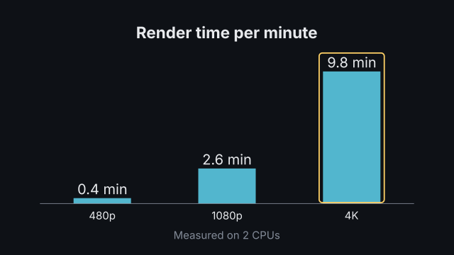
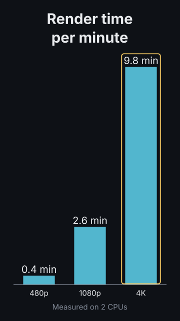
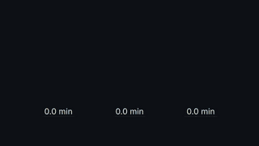
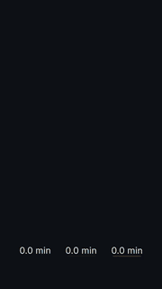

# `bar_chart`

<!-- Generated by `vidgen gallery`; edit the sample in AGENTS.md (or video.yaml), not this file. -->

**Use it for:** categories compared by size.

`horizontal` defaults to vertical bars, or horizontal ones in a portrait frame with more than 5 bars. `reveal: all` (default) grows every bar in beat 1; `per_beat` grows bar *i* at beat *i* (spread evenly when there are more bars than beats). With `highlight` set, one more step dims the other bars (it gets its own beat when there is one left).

Last beat, 16:9 and 9:16:

 

The scene playing (GIF, up to its last beat):

 

## YAML

From the author guide (`vidgen guide scenes`):

```yaml
- id: speed
  type: bar_chart
  params: {title: "Render time per minute", labels: ["480p", "1080p", "4K"], values: [0.4, 2.6, 9.8], unit: " min", caption: "Measured on 2 CPUs"}
  beats:
    - text: "Higher resolutions take much longer."
    - text: "Four K is twenty-five times slower than a preview."
      actions: [{highlight: "bar:4K", style: box}]
```

## Params

| param | type | default | notes |
|---|---|---|---|
| `title` | `str` |  | Chart title (in the header band at the top). (also: heading) |
| `labels` | `list[str]` | required | Bar labels. |
| `values` | `list[float]` | required | One value per label; negatives allowed. |
| `unit` | `str` |  | Appended to every value label, e.g. '%' or ' ms'. |
| `value_format` | `str \| None` |  | Python format for value labels, e.g. '{:.1f}'; default: the decimals the values need. |
| `colors` | `'palette' \| color \| list[color]` | `'primary'` | One color, one color per bar, or 'palette' (theme.palette). |
| `highlight` | `int \| str \| None` |  | Bar to highlight: 0-based index or label. |
| `highlight_color` | `color` | `'highlight'` | Color of the highlighted bar's value label. |
| `horizontal` | `bool \| None` |  | Horizontal bars; default: vertical, horizontal in a portrait frame with more than 5 bars. |
| `reveal` | `'all' \| 'per_beat'` | `'all'` | all: every bar grows in beat 1; per_beat: bar i grows at beat i. |
| `baseline` | `float` | `0.0` | Value the bars start from (e.g. 1.0 for losses). |
| `caption` | `str` |  | Note under the chart (e.g. the data source). |
| `caption_size` | `size` | `'caption'` | Caption text size. |
| `caption_color` | `color` | `'dim'` | Caption color. |
| `title_size` | `size` | `'heading'` | Title size (1.3x in a portrait frame). (also: heading_size) |
| `title_color` | `color` | `'text'` | Title color. (also: heading_color) |
| `label_size` | `size` | `'caption'` | Category label size (never below the readable minimum). |
| `value_size` | `size \| None` |  | Value label size; default body (caption with more than 6 bars). Labels too wide for their bar shrink towards the readable minimum, a word unit (' min') may move under the number, and in a portrait frame the bars turn horizontal when even that does not fit. |

## Targets

`title`, `bar<N>`, `bar:<label>`

## Beats

Any number.

[All scene types](README.md) · `vidgen list-scenes` · `vidgen schema --scene bar_chart`
