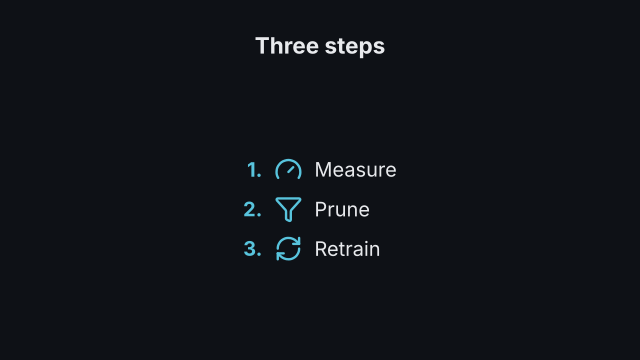
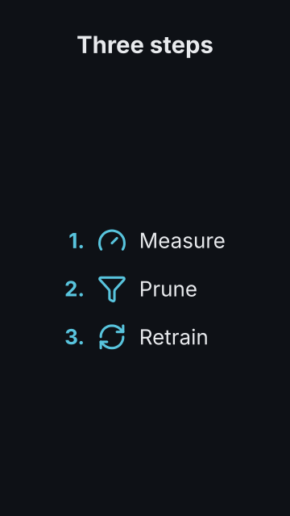

# `bullets`

<!-- Generated by `vidgen gallery`; edit the sample in AGENTS.md (or video.yaml), not this file. -->

**Use it for:** a few points, in order.

`reveal: per_beat` (default): item *i* appears at beat *i* (with the heading at beat 1); with more items than beats they are spread evenly, with fewer the remaining beats hold. `reveal: all`: every item appears during the first beat.

Last beat, 16:9 and 9:16:

 

The scene playing (GIF, up to its last beat):

 

## YAML

From the author guide (`vidgen guide scenes`):

```yaml
- id: steps
  type: bullets
  params:
    heading: "Three steps"
    numbered: true
    items: [{text: "Measure", icon: gauge}, {text: "Prune", icon: funnel}, {text: "Retrain", icon: refresh-cw}]
  beats:
    - text: "First, measure which weights matter."
    - text: "Then remove the rest."
    - text: "And retrain briefly to recover."
```

## Params

| param | type | default | notes |
|---|---|---|---|
| `heading` | `str` |  | Optional heading, shown with the first item. (also: title) |
| `items` | `list[str \| BulletItem]` | required | The list items (at least one): text, or {text, icon}; item i appears at beat i. |
| `items.text` | `str` | required | The item's text. |
| `items.icon` | `icon \| None` |  | Icon in the marker column (replaces the bullet; beside the number), in marker_color. |
| `reveal` | `'per_beat' \| 'all'` | `'per_beat'` | per_beat: one item per beat; all: every item in beat 1. |
| `numbered` | `bool` | `False` | Number the items (1. 2. ...) instead of using marker. |
| `dim_previous` | `bool` | `False` | Fade earlier items when a new one appears. |
| `marker` | `str` | `'•'` | Bullet character. |
| `size` | `size` | `'body'` | Item text size (shrunk automatically for long lists). |
| `heading_size` | `size` | `'heading'` | Heading text size. (also: title_size) |
| `color` | `color` | `'text'` | Item text color. |
| `heading_color` | `color` | `'text'` | Heading color. (also: title_color) |
| `marker_color` | `color` | `'primary'` | Bullet/number/icon color. |

## Targets

`heading`, `item<N>`, `item:<text>`

## Beats

Any number.

[All scene types](README.md) · `vidgen list-scenes` · `vidgen schema --scene bullets`
