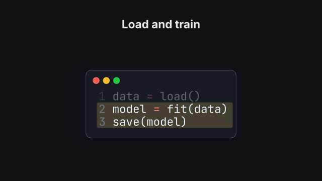
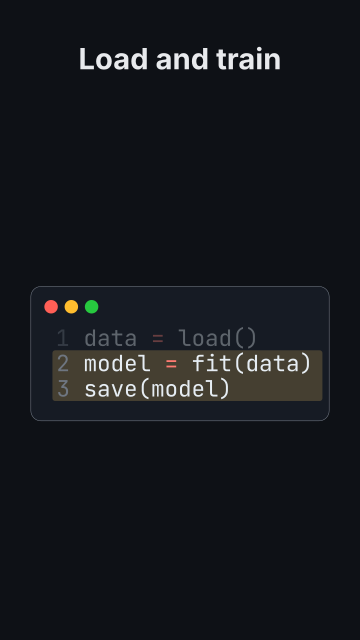

# `code`

<!-- Generated by `vidgen gallery`; edit the sample in AGENTS.md (or video.yaml), not this file. -->

**Use it for:** a short listing (≤ 15 lines).

Beat 1 shows the listing; `highlight` entry *i* is applied at beat *i* (entry 1 together with the listing). More entries than beats are spread evenly; later beats hold. Highlighting dims the other lines and marks the selected ones with a soft band.

Last beat, 16:9 and 9:16:

 

The scene playing (GIF, up to its last beat):

 

## YAML

From the author guide (`vidgen guide scenes`):

```yaml
- id: snippet
  type: code
  params: {title: "Load and train", code: "data = load()\nmodel = fit(data)\nsave(model)", highlight: ["1", "2-3"]}
  beats:
    - text: "We load the data."
    - text: "Then fit and save the model."
```

## Params

| param | type | default | notes |
|---|---|---|---|
| `code` | `str \| None` |  | Inline code; give exactly one of code / path. |
| `path` | `str \| None` |  | Code file in the project; give exactly one of code / path. |
| `language` | `str \| None` |  | Pygments lexer name; default: from the file name, else python. |
| `title` | `str` |  | Window title. (also: heading) |
| `highlight` | `list[int \| str \| list[int]]` |  | Entry i applies at beat i: 3, '2-4', '1, 5-6' or [1, 4] (1-based lines). |
| `line_numbers` | `bool` | `True` | Show line numbers. |
| `style` | `str \| None` |  | Pygments style (monokai, dracula, xcode, ...); default: the theme's code_style. |
| `font` | `str \| None` |  | Font family of the listing; default: the theme's font for the `code` role (font_mono, JetBrains Mono NL). |
| `size` | `size` | `'caption'` | Starting font size (scaled to fill the frame, up to 1.5x). |
| `highlight_color` | `color` | `'highlight'` | Color of the highlight band. |
| `wrap` | `bool` | `True` | Wrap long lines (hanging indent) when the listing would otherwise be scaled below size (or the readable minimum), mostly in vertical formats; highlights keep their lines. |

## Targets

`title`, `listing`, `line<N>`, `lines:<a-b>`

## Beats

Any number.

[All scene types](README.md) · `vidgen list-scenes` · `vidgen schema --scene code`
