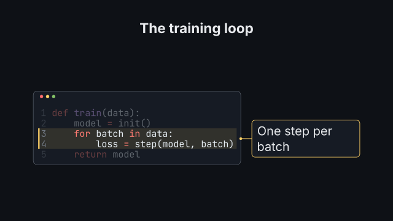
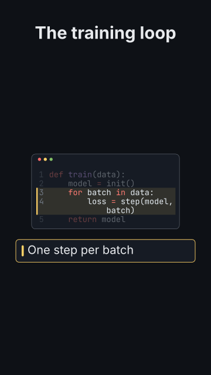

# `code_walkthrough`

<!-- Generated by `vidgen gallery`; edit the sample in AGENTS.md (or video.yaml), not this file. -->

**Use it for:** a long file, explained part by part.

A long listing in a window of fixed height. Step *i* (an entry of `steps`) plays at beat *i* (step 1 with the window): it scrolls so its `lines` are in view, highlights them (the others dim, a band marks them), shows its `note` and, with `focus`, moves the camera in. A step without `lines` keeps the view. More steps than beats are spread evenly; later beats hold.

Last beat, 16:9 and 9:16:

 

The scene playing (GIF, up to its last beat):

 

## YAML

From the author guide (`vidgen guide scenes`):

```yaml
- id: walk
  type: code_walkthrough
  params:
    title: "The training loop"
    code: "def train(data):\n    model = init()\n    for batch in data:\n        loss = step(model, batch)\n    return model"
    steps: [{lines: "1-2", note: "Set up the model"}, {lines: "3-4", note: "One step per batch"}]
  beats:
    - text: "The function starts by creating the model."
    - text: "Then it takes one step per batch."
```

## Params

| param | type | default | notes |
|---|---|---|---|
| `code` | `str \| None` |  | Inline code; give exactly one of code / path. |
| `path` | `str \| None` |  | Code file in the project; give exactly one of code / path. |
| `language` | `str \| None` |  | Pygments lexer name; default: from the file name, else python. |
| `excerpt` | `str \| None` |  | Show only lines 'a-b' of the code (they keep their numbers; steps use them too). |
| `title` | `str` |  | Window title, above it. (also: heading) |
| `steps` | `list[str \| int \| list \| WalkStep]` |  | Step i plays at beat i: {lines, note, focus}, or just a line spec ('3-7'). |
| `steps.lines` | `int \| str \| list[int \| str] \| None` |  | Lines to highlight and scroll into view: 12, '3-7', '1, 5-6', [3, 4], '/regex/' (the first line it matches), '/def fit/-/return/' (a range), or 'all' (no highlight). None: keep the previous step's lines and view. |
| `steps.note` | `str` |  | A short annotation shown with this step (beside the lines, or below the window). |
| `steps.focus` | `bool \| float` | `False` | Enlarge: the camera moves in on the lines (and the note) during this step; a number is the magnification (more than 1, up to 4), true: as close as they fit, up to focus_scale. |
| `visible` | `int \| None` |  | Lines the window shows at once (default: as many as fit at size). |
| `line_numbers` | `bool` | `True` | Show line numbers. |
| `style` | `str \| None` |  | Pygments style (monokai, dracula, xcode, ...); default: the theme's code_style. |
| `font` | `str \| None` |  | Font family of the listing; default: the theme's font for the `code` role (font_mono). |
| `size` | `size` | `'caption'` | Font size of the listing (smaller only to fit the width, never below the readable size: long lines wrap). |
| `wrap` | `bool` | `True` | Wrap long lines (hanging indent) instead of shrinking the listing below size / the readable size. |
| `highlight_color` | `color` | `'highlight'` | Color of the highlight band, the notes' frame and the scroll target. |
| `note_position` | `'auto' \| 'side' \| 'bottom'` | `'auto'` | Where notes go: side (a callout beside the window), bottom (a bar below it; always in a vertical frame), auto (side in 16:9 when the code fits beside them without wrapping, else bottom). |
| `note_size` | `size` | `'body'` | Note text size. |
| `note_color` | `color` | `'text'` | Note text color. |
| `focus_scale` | `float` | `2.0` | Largest magnification of focus: true. |
| `scrollbar` | `bool` | `True` | Show a scroll indicator when the code is longer than the window. |

## Targets

`title`, `listing`, `line<N>`, `lines:<a-b>`, `note<N>`

## Beats

Any number.

[All scene types](README.md) · `vidgen list-scenes` · `vidgen schema --scene code_walkthrough`
