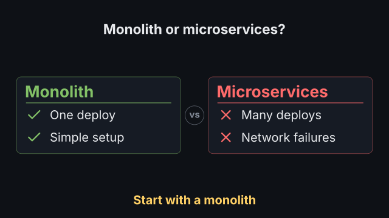

# `comparison`

<!-- Generated by `vidgen gallery`; edit the sample in AGENTS.md (or video.yaml), not this file. -->

**Use it for:** A vs B, before / after, pros / cons.

`reveal: columns` (default): column *i* (card, heading and its points) appears at beat *i*; `rows`: beat 1 shows the column headings, then each beat adds the next point of every column; `all`: everything in beat 1. A `verdict` comes in a last step. The heading comes with the first step.

Last beat, 16:9 and 9:16:

 

The scene playing (GIF, up to its last beat):

 

## YAML

From the author guide (`vidgen guide scenes`):

```yaml
- id: choice
  type: comparison
  params:
    heading: "Monolith or microservices?"
    vs: "vs"
    columns:
      - {heading: "Monolith", tone: positive, points: ["One deploy", "Simple setup"]}
      - {heading: "Microservices", tone: negative, points: ["Many deploys", "Network failures"]}
    verdict: "Start with a monolith"
  beats:
    - text: "A monolith ships as one piece."
    - text: "Microservices multiply the moving parts."
    - text: "So start simple, and split later."
```

## Params

| param | type | default | notes |
|---|---|---|---|
| `columns` | `list[ComparisonColumn]` | required | Two or three columns, {heading, icon?, tone?, points}, left to right (top to bottom in 9:16). |
| `columns.heading` | `str` | required | The column's heading ('Before', 'Option A'). (also: title) |
| `columns.icon` | `icon \| None` |  | Optional icon left of the heading, in the tone colour. |
| `columns.tone` | `'positive' \| 'negative' \| 'neutral'` | `'neutral'` | positive (check marks, positive_color), negative (crosses, negative_color) or neutral (dots, neutral_color). |
| `columns.points` | `list[str \| ComparisonPoint]` |  | The column's points (up to 8): text, or {text, icon}. |
| `columns.points.text` | `str` | required | The point's text. |
| `columns.points.icon` | `icon \| None` |  | Icon in place of the column's marker, in the column's tone colour. |
| `heading` | `str` |  | Optional heading above the columns. (also: title) |
| `verdict` | `str` |  | Optional conclusion under the columns, shown in a last step. |
| `reveal` | `'columns' \| 'rows' \| 'all'` | `'columns'` | columns: one column per beat; rows: headings, then one point of every column per beat; all: everything in beat 1. |
| `markers` | `bool` | `True` | Mark points by tone: check (positive), cross (negative), dot (neutral). |
| `cards` | `bool` | `True` | Draw each column on a card in the theme's surface colour. |
| `vs` | `str` |  | Text in a badge between the columns, e.g. 'vs'; empty for none. |
| `positive_color` | `color` | `'tertiary'` | Tone colour of positive columns (heading, icon, markers). |
| `negative_color` | `color` | `'accent'` | Tone colour of negative columns. |
| `neutral_color` | `color` | `'primary'` | Tone colour of neutral columns (markers and icon; the heading stays heading_color). |
| `color` | `color` | `'text'` | Point text colour. |
| `heading_color` | `color` | `'text'` | Colour of the scene heading and of neutral column headings. (also: title_color) |
| `verdict_color` | `color` | `'highlight'` | Verdict colour. |
| `size` | `size` | `'body'` | Point text size (reduced, not below the readable minimum, when space is short). |
| `column_size` | `size` | `'subtitle'` | Column heading size (reduced with the points). |
| `heading_size` | `size` | `'heading'` | Scene heading size. (also: title_size) |
| `verdict_size` | `size` | `'body'` | Verdict size. |

## Targets

`heading`, `col<N>`, `col:<heading>`, `col<N>.item<M>`, `verdict`

## Beats

Any number.

[All scene types](README.md) · `vidgen list-scenes` · `vidgen schema --scene comparison`
