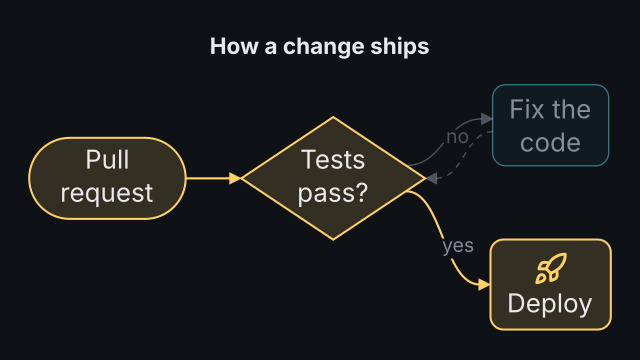
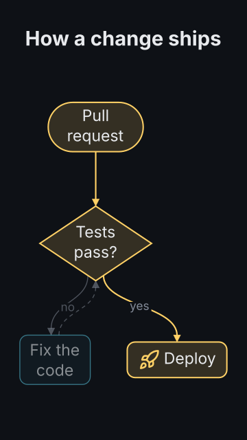

# `diagram`

<!-- Generated by `vidgen gallery`; edit the sample in AGENTS.md (or video.yaml), not this file. -->

**Use it for:** how parts connect, decisions, architecture.

A flowchart or any directed graph, laid out automatically in layers (left to right in 16:9 and square frames, top to bottom in 9:16), revealed step by step: by default one node per step in layout order, each after the edges that lead to it grow in from their source (`reveal: layers` one layer per step, `all` everything at once, or explicit `steps`). Steps are spread over the beats; a `highlight` path adds a last step. Registered also as `flowchart`.

Also available as `flowchart` (the same type).

Last beat, 16:9 and 9:16:

 

The scene playing (GIF, up to its last beat):

 

## YAML

From the author guide (`vidgen guide scenes`):

```yaml
- id: release
  type: diagram
  params:
    heading: "How a change ships"
    nodes:
      - {id: pr, label: "Pull request", shape: pill}
      - {id: ci, label: "Tests pass?", shape: diamond}
      - {id: fix, label: "Fix the code"}
      - {id: ship, label: "Deploy", icon: rocket}
    edges: ["pr -> ci", "ci -> ship: yes", "ci -> fix: no", "fix --> ci"]
    highlight: [pr, ci, ship]
  beats:
    - text: "Every change starts as a pull request."
    - text: "The tests decide what happens next."
    - text: "A failure goes back for a fix."
    - text: "A pass goes straight to production."
    - text: "That is the path most changes take."
```

## Params

| param | type | default | notes |
|---|---|---|---|
| `nodes` | `list[str \| DiagramNode]` | required | The nodes: an id string, or {id, label?, shape?, icon?, color?} (1-30; up to ~12 read well). |
| `nodes.id` | `str` | required | Name used by edges, steps and targets (letters, digits, spaces, _ . -). |
| `nodes.label` | `str` |  | Text in the node (default: the id; wrapped to fit). |
| `nodes.shape` | `'box' \| 'round' \| 'pill' \| 'circle' \| 'diamond' \| 'cylinder' \| None` |  | box, round, pill, circle, diamond or cylinder (default: the scene's shape). |
| `nodes.icon` | `icon \| None` |  | Optional icon with the label: above it in left-to-right layouts, circles and diamonds, else beside it. |
| `nodes.color` | `color \| None` |  | Outline, tint and icon colour (default: the scene's node_color). |
| `edges` | `list[str \| DiagramEdge]` |  | The edges: 'a -> b', 'a -> b: label', 'a --> b' (dashed), chains 'a -> b -> c', or {from, to, label?, style?, color?}. |
| `edges.from` | `str` | required | Node id the edge starts at. |
| `edges.to` | `str` | required | Node id the arrow points to. |
| `edges.label` | `str` |  | Optional text on the edge, near its start. |
| `edges.style` | `'solid' \| 'dashed'` | `'solid'` | solid or dashed line. |
| `edges.color` | `color \| None` |  | Line colour (default: the scene's edge_color). |
| `heading` | `str` |  | Optional heading above the diagram. (also: title) |
| `direction` | `'auto' \| 'LR' \| 'TB'` | `'auto'` | LR: layers left to right; TB: top to bottom; auto: LR in landscape and square frames, TB in portrait (the other one if it keeps text much larger). |
| `routing` | `'curved' \| 'straight' \| 'orthogonal'` | `'curved'` | Edge lines: curved (smooth S-curves), straight (polylines) or orthogonal (right angles). |
| `reveal` | `'nodes' \| 'layers' \| 'all'` | `'nodes'` | nodes: one node per step in layout order (edges into it first); layers: one layer per step; all: everything in one step. |
| `steps` | `list[list[str] \| str] \| None` |  | Explicit steps instead of reveal: per step a node id or edge 'a->b', or a list of them; edges between shown nodes come along; anything not listed comes in one more step. |
| `highlight` | `list[str] \| str` |  | A path or set to emphasise in a last step: node ids (with the edges between consecutive ones) and edges 'a->b'; the rest dims. |
| `shape` | `'box' \| 'round' \| 'pill' \| 'circle' \| 'diamond' \| 'cylinder'` | `'round'` | Default node shape: box, round, pill, circle, diamond or cylinder. |
| `node_color` | `color` | `'primary'` | Default node outline, tint and icon colour. |
| `label_color` | `color` | `'text'` | Node label colour. |
| `edge_color` | `color` | `'dim'` | Default edge colour. |
| `edge_label_color` | `color` | `'dim'` | Edge label colour. |
| `heading_color` | `color` | `'text'` | Heading colour. (also: title_color) |
| `highlight_color` | `color` | `'highlight'` | Outline and line colour of the highlighted nodes and edges. |
| `size` | `size` | `'body'` | Node label size (up to 1.3x larger in a small diagram; reduced, not below the readable minimum, when space is short). |
| `edge_label_size` | `size` | `'caption'` | Edge label size (reduced with the node labels). |
| `heading_size` | `size` | `'heading'` | Heading size. (also: title_size) |

## Targets

`heading`, `node<N>`, `node:<id>`, `edge:<from>-><to>`

## Beats

Any number.

[All scene types](README.md) · `vidgen list-scenes` · `vidgen schema --scene diagram`
