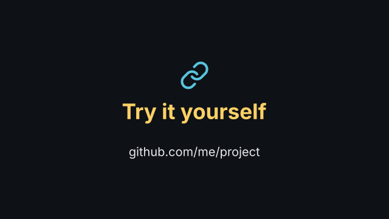
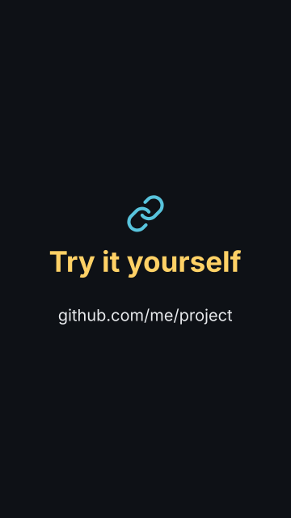

# `end_card`

<!-- Generated by `vidgen gallery`; edit the sample in AGENTS.md (or video.yaml), not this file. -->

**Use it for:** thanks, links, call to action.

Beat 1 reveals the logo, icon and title, beat 2 the lines (both in beat 1 if there is only one); further beats hold. The scene ends with a slower fade-out.

Last beat, 16:9 and 9:16:

 

The scene playing (GIF, up to its last beat):

 

## YAML

From the author guide (`vidgen guide scenes`):

```yaml
- id: outro
  type: end_card
  params: {title: "Try it yourself", icon: link, lines: ["github.com/me/project"]}
  beats: [{text: "The code is online. Try it on your own model."}]
```

## Params

| param | type | default | notes |
|---|---|---|---|
| `title` | `str` |  | Closing message; at least one of title, lines, logo, icon. |
| `lines` | `list[str]` |  | Links, credits; short lines shrink together instead of wrapping. |
| `logo` | `str \| None` |  | Image file in the project. |
| `icon` | `icon \| None` |  | Icon above the title (below the logo, if both). |
| `icon_color` | `color` | `'primary'` | Icon color. |
| `title_color` | `color` | `'highlight'` | Title color. |
| `color` | `color` | `'text'` | Lines color. |
| `title_size` | `size` | `'title'` | Title text size. |
| `size` | `size` | `'body'` | Lines text size. |

## Targets

`logo`, `icon`, `title`, `line<N>`

## Beats

Any number.

[All scene types](README.md) · `vidgen list-scenes` · `vidgen schema --scene end_card`
