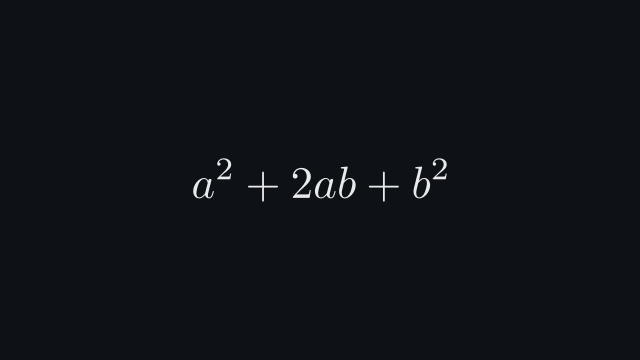
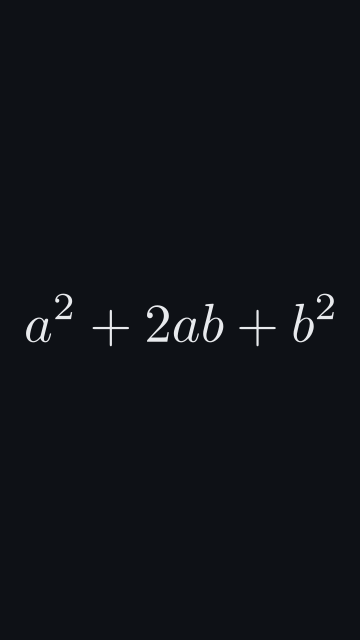

# `equation`

<!-- Generated by `vidgen gallery`; edit the sample in AGENTS.md (or video.yaml), not this file. -->

**Use it for:** a formula that transforms.

Step *i* of `latex` (a string is one step) appears at beat *i*, each morphing into the next; with more steps than beats they are spread evenly. The caption appears with step 1.

Last beat, 16:9 and 9:16:

 

The scene playing (GIF, up to its last beat):

 

## YAML

From the author guide (`vidgen guide scenes`):

```yaml
- id: square
  type: equation
  params: {latex: ["(a + b)^2", "a^2 + 2ab + b^2"], terms: ["2ab"]}
  beats:
    - text: "Take a plus b, squared."
    - text: "The middle term is where the cross products hide."
      actions: [{zoom: "term:2ab"}]
```

## Params

| param | type | default | notes |
|---|---|---|---|
| `latex` | `str \| list[str]` | required | Math-mode LaTeX (no $); a list is a sequence of steps, step i at beat i. |
| `caption` | `str` |  | Caption under the formula. |
| `size` | `size` | `96` | Formula size. |
| `color` | `color` | `'text'` | Formula color. |
| `caption_color` | `color` | `'dim'` | Caption color. |
| `caption_size` | `size` | `'caption'` | Caption text size. |
| `terms` | `list[str]` |  | TeX substrings beat actions can target as term:<tex> (each a complete TeX group of some step, e.g. '2ab'). |

## Targets

`step<N>`, `caption`, `term:<tex>`

## Beats

Any number.

[All scene types](README.md) · `vidgen list-scenes` · `vidgen schema --scene equation`
