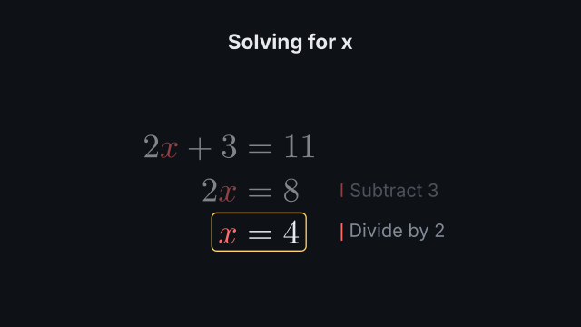
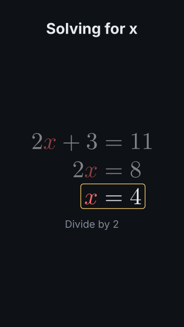

# `equation_derivation`

<!-- Generated by `vidgen gallery`; edit the sample in AGENTS.md (or video.yaml), not this file. -->

**Use it for:** a derivation with reasons.

Step *i* (an entry of `steps`) arrives at beat *i*: the previous step morphs into it (its marked parts move into place) and its note appears. In `history` mode earlier steps stay, stacked above and dimmed, aligned at `align_at`; in `replace` mode each step takes the place of the one before. The last step gets a box (`result`). More steps than beats are spread evenly; later beats hold.

Last beat, 16:9 and 9:16:

 

The scene playing (GIF, up to its last beat):

 

## YAML

From the author guide (`vidgen guide scenes`):

```yaml
- id: solve
  type: equation_derivation
  params:
    title: "Solving for x"
    colors: {x: accent}
    steps: ['2x + 3 = 11', {tex: '2x = 8', note: "Subtract 3"}, {tex: 'x = 4', note: "Divide by 2"}]
  beats:
    - text: "Two x plus three is eleven."
    - text: "Take three from both sides."
    - text: "So x is four."
```

## Params

| param | type | default | notes |
|---|---|---|---|
| `steps` | `list[str \| DerivationStep]` | required | Step i arrives at beat i: {tex, note, match, transition}, or just the LaTeX. |
| `steps.tex` | `str` | required | Math-mode LaTeX (no $). Mark a part that moves into the same part of the next step as {{ ... }} (with a space or the start before {{). |
| `steps.note` | `str` |  | A short justification shown with this step ('divide both sides by 2'): beside the equations (16:9) or below them (9:16). |
| `steps.match` | `list[str]` |  | TeX parts that move from the previous step into this one (isolated in both steps), as an alternative to marking them {{ }}. |
| `steps.transition` | `'auto' \| 'shapes' \| 'fade'` | `'auto'` | How the previous step becomes this one: auto (marked parts move into each other, the other glyphs move when their shapes match, else fade), shapes (glyphs by shape only), fade (cross-fade). |
| `title` | `str` |  | Heading above the derivation. (also: heading) |
| `mode` | `'history' \| 'replace'` | `'history'` | history: earlier steps stay, stacked above the current one and dimmed; replace: each step takes the place of the previous one. |
| `keep` | `int \| None` |  | history: the most steps on screen at once (the oldest scroll away); default: as many as fit at a readable size. |
| `align_at` | `str` | `'='` | Steps are aligned at the first occurrence of this TeX (a relation such as '=' or '\le'); '' centres every step. |
| `colors` | `dict[str, color]` |  | Parts coloured in every step, TeX -> color: {x: accent, '\lambda': highlight}. |
| `terms` | `list[str]` |  | More TeX parts to isolate in every step (they move into each other and are targets term:<tex>). |
| `result` | `'box' \| 'highlight' \| 'none'` | `'box'` | Marks the last step: a box around it, a highlight band behind it, or nothing. |
| `result_color` | `color` | `'highlight'` | Color of the result box / band. |
| `size` | `size` | `80` | Formula size (the largest; smaller to fit the width and the stacked steps, not below the readable size). |
| `color` | `color` | `'text'` | Formula color. |
| `dim_opacity` | `float` | `0.45` | history: opacity of the earlier steps and their notes (raised where a colour would fall below 2.3:1 contrast with the background). |
| `note_position` | `'auto' \| 'side' \| 'bottom'` | `'auto'` | Where notes go: side (beside the equations, level with their step), bottom (below them, one at a time), auto (side in 16:9, bottom in a vertical frame). |
| `note_size` | `size` | `'body'` | Note text size. |
| `note_color` | `color` | `'dim'` | Note text color. |
| `note_mark_color` | `color` | `'accent'` | Color of the bar beside each note. |

## Targets

`title`, `step<N>`, `note<N>`, `result`, `term:<tex>`

## Beats

Any number.

[All scene types](README.md) · `vidgen list-scenes` · `vidgen schema --scene equation_derivation`
