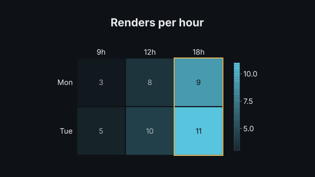
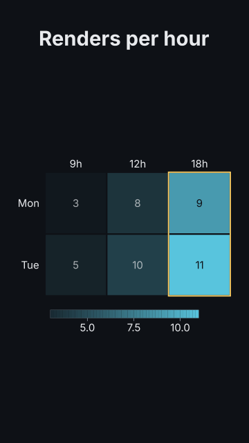

# `heatmap`

<!-- Generated by `vidgen gallery`; edit the sample in AGENTS.md (or video.yaml), not this file. -->

**Use it for:** a matrix (correlations, hours x days).

`reveal: all` (default) brings the labels and the legend, and the cells in a wave from the top left corner, in beat 1; `rows` reveals one row per beat (the column labels and the legend with the first). With `highlight` set, a last step outlines the chosen cells, rows or columns and dims the rest.

Last beat, 16:9 and 9:16:

 

The scene playing (GIF, up to its last beat):

 

## YAML

From the author guide (`vidgen guide scenes`):

```yaml
- id: busy
  type: heatmap
  params:
    title: "Renders per hour"
    rows: ["Mon", "Tue"]
    columns: ["9h", "12h", "18h"]
    values: [[3, 8, 9], [5, 10, 11]]
    highlight: "col:18h"
  beats:
    - text: "Each cell counts the renders in one hour."
    - text: "Evenings are the busiest."
```

## Params

| param | type | default | notes |
|---|---|---|---|
| `values` | `list[list[float \| None]]` | required | The matrix, row by row (null: no data, drawn as an empty cell). |
| `rows` | `list[str]` |  | Row labels (left of the rows; unique). |
| `columns` | `list[str]` |  | Column labels (above the columns; unique). |
| `title` | `str` |  | Chart title (in the header band at the top). (also: heading) |
| `scale` | `'auto' \| 'sequential' \| 'diverging'` | `'auto'` | Colour scale: sequential (low to high), diverging (two colours either side of center); auto: diverging when the values have both signs around center. |
| `color` | `color` | `'primary'` | Sequential scale: the colour of the highest values (low values are a faint tint of it). |
| `low_color` | `color` | `'primary'` | Diverging scale: the colour below center. |
| `high_color` | `color` | `'accent'` | Diverging scale: the colour above center. |
| `center` | `float` | `0.0` | Diverging scale: the neutral middle value. |
| `scale_min` | `float \| None` |  | Value at the low end of the scale; default: the data's minimum (diverging: symmetric around center). |
| `scale_max` | `float \| None` |  | Value at the high end of the scale; default: the data's maximum. |
| `show_values` | `bool \| None` |  | Write each value in its cell; default: when the cells are large enough for readable text. |
| `value_format` | `str \| None` |  | Python format for cell values and legend ticks, e.g. '{:.2f}'; default: the decimals the values need. |
| `unit` | `str` |  | Appended to cell values and legend ticks. |
| `legend` | `bool` | `True` | Show the colour scale as a bar with ticks (right of the matrix; below it in 9:16). |
| `legend_label` | `str` |  | Title over the legend bar (what the colour means). |
| `reveal` | `'all' \| 'rows'` | `'all'` | all: every cell in beat 1 (a wave from the top left); rows: row i at beat i. |
| `highlight` | `list[str] \| str` |  | Cells, rows or columns outlined in a last step (the rest dims): cell<R>.<C>, row<N>, row:<label>, col<N>, col:<label>. |
| `highlight_color` | `color` | `'highlight'` | Outline colour of highlighted cells. |
| `label_size` | `size` | `'caption'` | Size of row / column labels and legend ticks (never below the readable minimum). |
| `value_size` | `size` | `'caption'` | Largest size of the values in the cells (they shrink to fit, down to the readable minimum, else they are hidden). |
| `caption` | `str` |  | Note under the chart (e.g. the data source). |
| `caption_size` | `size` | `'caption'` | Caption text size. |
| `caption_color` | `color` | `'dim'` | Caption color. |
| `title_size` | `size` | `'heading'` | Title size (1.3x in a portrait frame). (also: heading_size) |
| `title_color` | `color` | `'text'` | Title color. (also: heading_color) |

## Targets

`title`, `legend`, `row<N>`, `row:<label>`, `col<N>`, `col:<label>`, `cell<R>.<C>`

## Beats

Any number.

[All scene types](README.md) · `vidgen list-scenes` · `vidgen schema --scene heatmap`
