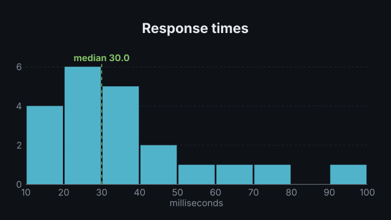
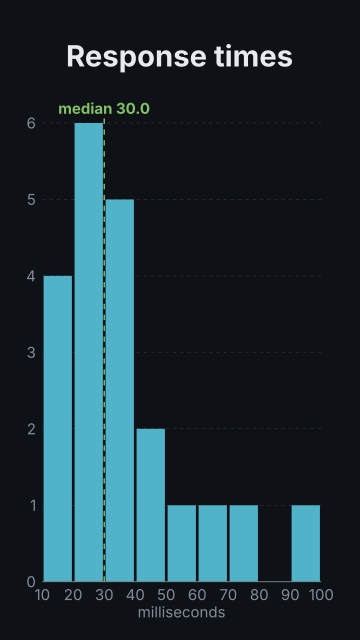

# `histogram`

<!-- Generated by `vidgen gallery`; edit the sample in AGENTS.md (or video.yaml), not this file. -->

**Use it for:** how values are distributed.

Step 1 draws the axes and grows the bars from left to right; then (each a step of its own, so one per beat when there are enough) the `compare` outline, the `mean` and `median` markers, and the `highlight` of chosen bins (the others dim).

Last beat, 16:9 and 9:16:

 

The scene playing (GIF, up to its last beat):

 

## YAML

From the author guide (`vidgen guide scenes`):

```yaml
- id: latency
  type: histogram
  params:
    title: "Response times"
    x_label: "milliseconds"
    values: [12, 15, 17, 18, 21, 22, 23, 25, 26, 28, 30, 31, 33, 35, 38, 41, 45, 52, 61, 75, 97]
    median: true
  beats:
    - text: "Most requests finish fast."
    - text: "Half of them in under thirty milliseconds."
```

## Params

| param | type | default | notes |
|---|---|---|---|
| `values` | `list[float]` |  | Raw values to bin (or give counts and edges). |
| `bins` | `int \| 'auto' \| 'sturges' \| 'sqrt' \| 'fd'` | `'auto'` | Number of equal bins over the range, or a rule (auto, sturges, sqrt, fd: Freedman-Diaconis) whose bin width is rounded to 1, 2, 2.5 or 5 x 10^k with edges on its multiples. |
| `bin_width` | `float \| None` |  | Bin width (edges on its multiples, or from bin_range's start); overrides bins. |
| `bin_range` | `list[float] \| None` |  | [low, high] of the bins; default: the values' range. Values outside are left out. |
| `counts` | `list[float]` |  | Counts per bin, instead of values (with edges). |
| `edges` | `list[float]` |  | Bin edges for counts: one more than counts, increasing. |
| `name` | `str` |  | Legend name of the distribution (shown with compare). |
| `compare` | `HistogramCompare \| None` |  | A second distribution over the same bins, drawn as an outline: {name, values or counts, color}. |
| `compare.name` | `str` |  | Its legend name. |
| `compare.values` | `list[float]` |  | Raw values (binned like the main ones; values outside the bins are left out). |
| `compare.counts` | `list[float]` |  | Counts per bin instead of values (one per bin). |
| `compare.color` | `color` | `'secondary'` | Outline color. |
| `percent` | `bool` | `False` | Show each bin's share of the total (%) instead of counts. |
| `mean` | `bool` | `False` | Mark the mean with a dashed line and its value (in a step of its own). |
| `median` | `bool` | `False` | Mark the median likewise. |
| `highlight` | `list[int \| str] \| int \| str` |  | Bins emphasised in a last step: 0-based index or range ('10-20'); the others dim. |
| `title` | `str` |  | Chart title (in the header band at the top). (also: heading) |
| `x_label` | `str` |  | X axis label (what was measured). |
| `y_label` | `str` |  | Y axis label (e.g. 'count'). |
| `x_format` | `str \| None` |  | Python format for the bin edges on the axis and in bin:<range> names; default: automatic. |
| `x_unit` | `str` |  | Appended to x tick labels and the mean / median values. |
| `y_format` | `str \| None` |  | Python format for y tick labels; default: automatic. |
| `color` | `color` | `'primary'` | Bar color. |
| `mean_color` | `color` | `'accent'` | Mean marker color. |
| `median_color` | `color` | `'tertiary'` | Median marker color. |
| `highlight_color` | `color` | `'highlight'` | Fill of highlighted bins. |
| `label_size` | `size` | `'caption'` | Size of tick labels, axis labels, marker labels and the legend (never below the readable minimum). |
| `caption` | `str` |  | Note under the chart (e.g. the data source). |
| `caption_size` | `size` | `'caption'` | Caption text size. |
| `caption_color` | `color` | `'dim'` | Caption color. |
| `title_size` | `size` | `'heading'` | Title size (1.3x in a portrait frame). (also: heading_size) |
| `title_color` | `color` | `'text'` | Title color. (also: heading_color) |

## Targets

`title`, `axes`, `legend`, `bin<N>`, `bin:<range>`, `compare`, `mean`, `median`

## Beats

Any number.

[All scene types](README.md) · `vidgen list-scenes` · `vidgen schema --scene histogram`
