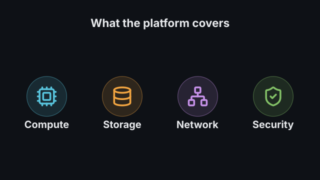
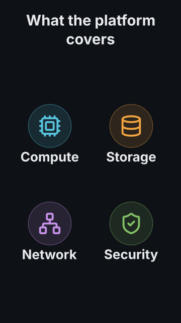

# `icon_grid`

<!-- Generated by `vidgen gallery`; edit the sample in AGENTS.md (or video.yaml), not this file. -->

**Use it for:** a set of things (features, parts, options).

`reveal: per_beat` (default): item *i* appears at beat *i* (the heading with the first); with more items than beats they are spread evenly. `groups` reveals several items per step instead; `reveal: all` shows every item in beat 1. A `highlight` adds a last step that dims the other items and enlarges the highlighted one.

Last beat, 16:9 and 9:16:

 

The scene playing (GIF, up to its last beat):

 

## YAML

From the author guide (`vidgen guide scenes`):

```yaml
- id: parts
  type: icon_grid
  params:
    heading: "What the platform covers"
    icon_color: palette
    items:
      - {icon: cpu, label: "Compute"}
      - {icon: database, label: "Storage"}
      - {icon: network, label: "Network"}
      - {icon: shield-check, label: "Security"}
    groups: [[0, 1], [2, 3]]
  beats:
    - text: "Compute and storage come first."
    - text: "Then networking and security."
```

## Params

| param | type | default | notes |
|---|---|---|---|
| `items` | `list[GridItem]` | required | The cells, {icon, label, sublabel?}, in reading order (2-12 look best). |
| `items.icon` | `icon` | required | The icon (name or alias, see `vidgen list-icons`). |
| `items.label` | `str` | required | Short label under the icon (wrapped to the cell). |
| `items.sublabel` | `str` |  | Optional second line, smaller and dimmer. |
| `heading` | `str` |  | Optional heading, shown with the first step. (also: title) |
| `columns` | `int \| None` |  | Number of columns; default: chosen for the frame (grid_shape). |
| `reveal` | `'per_beat' \| 'all'` | `'per_beat'` | per_beat: one item per beat; all: every item in beat 1. |
| `groups` | `list[list[int \| str]] \| None` |  | Reveal steps as lists of items (0-based index or label); each item exactly once. |
| `highlight` | `int \| str \| None` |  | Item (0-based index or label) emphasised in a last step. |
| `badge` | `bool` | `True` | Draw each icon on a soft disc in its color. |
| `icon_color` | `'palette' \| color` | `'primary'` | One color for every icon, or 'palette' (theme.palette, one per item). |
| `color` | `color` | `'text'` | Label color. |
| `sublabel_color` | `color` | `'dim'` | Sublabel color. |
| `heading_color` | `color` | `'text'` | Heading color. (also: title_color) |
| `highlight_color` | `color` | `'highlight'` | Color of the highlighted item's icon. |
| `size` | `size` | `'body'` | Label text size (reduced, not below the readable minimum, when space is short). |
| `sublabel_size` | `size` | `'caption'` | Sublabel text size. |
| `heading_size` | `size` | `'heading'` | Heading text size. (also: title_size) |

## Targets

`heading`, `item<N>`, `item:<label>`

## Beats

Any number.

[All scene types](README.md) · `vidgen list-scenes` · `vidgen schema --scene icon_grid`
