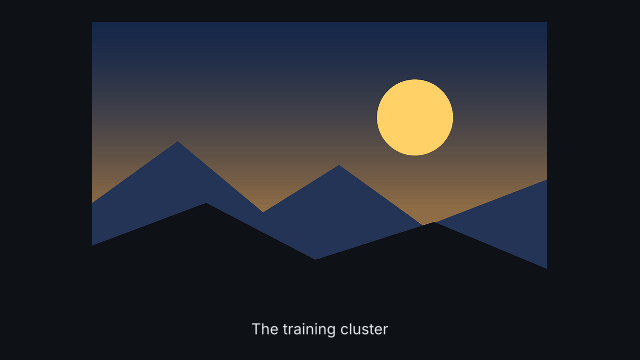
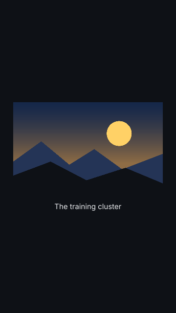
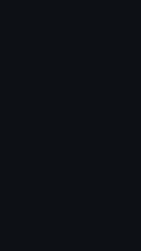

# `image`

<!-- Generated by `vidgen gallery`; edit the sample in AGENTS.md (or video.yaml), not this file. -->

**Use it for:** a photo or illustration.

Beat 1 fades the image in, beat 2 the caption (both in beat 1 if there is only one).

Last beat, 16:9 and 9:16:

 

The scene playing (GIF, up to its last beat):

 

## YAML

From the author guide (`vidgen guide scenes`):

```yaml
- id: lab
  type: image
  params: {path: assets/lab.png, caption: "The training cluster"}
  beats: [{text: "Everything ran on this machine."}]
```

## Params

| param | type | default | notes |
|---|---|---|---|
| `path` | `str \| None` |  | Image file relative to the project folder, e.g. assets/photo.jpg (or generate). |
| `generate` | `str \| GenerateImage \| None` |  | A generated picture instead of a file: {prompt, negative, style, aspect, seed} or the prompt; made by `vidgen imagegen`, a placeholder until then. |
| `generate.prompt` | `str` | required | What the picture shows, e.g. "a lighthouse on a cliff at dawn" (keep words out of it: generators draw text poorly). |
| `generate.negative` | `str` |  | What the picture should not show (added to the prompt as "Avoid: ..."), e.g. "people, text". |
| `generate.style` | `str \| None` |  | Style words added to the prompt: a preset (photo, illustration, flat, isometric, watercolor, line_art, render_3d, cinematic), your own words, or none; default imagegen.style. |
| `generate.aspect` | `'auto' \| 'landscape' \| 'portrait' \| 'square'` | `'auto'` | Shape of the picture: auto (the video's: landscape for 16:9, portrait for 9:16, square), landscape, portrait or square. |
| `generate.seed` | `int \| None` |  | Another number asks for another picture of the same prompt (part of the cache key; OpenAI takes no seed, so it does not make a picture reproducible). |
| `caption` | `str` |  | Caption text. |
| `fit` | `'contain' \| 'cover'` | `'contain'` | contain: whole image, caption below; cover: fills the frame (cropped), caption on a band. |
| `ken_burns` | `KenBurns \| bool` | `False` | Slow zoom/pan over the whole scene; true = zoom 1.0 -> 1.15 on the center. |
| `ken_burns.start_scale` | `float` | `1.0` | Zoom at the start of the scene (1-4). |
| `ken_burns.end_scale` | `float` | `1.15` | Zoom at the end of the scene (1-4). |
| `ken_burns.start_focus` | `tuple[float, float]` | `(0.5, 0.5)` | [x, y] in 0-1 (0,0 = top left) centered at the start. |
| `ken_burns.end_focus` | `tuple[float, float]` | `(0.5, 0.5)` | [x, y] in 0-1 (0,0 = top left) centered at the end. |
| `caption_color` | `color` | `'text'` | Caption color. |
| `caption_size` | `size` | `'caption'` | Caption text size. |

## Targets

`image`, `caption`

## Beats

Any number.

[All scene types](README.md) · `vidgen list-scenes` · `vidgen schema --scene image`
