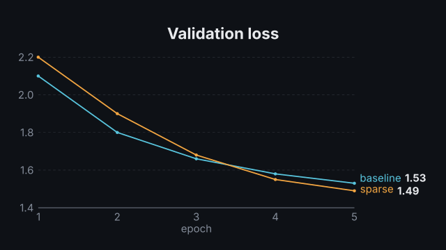
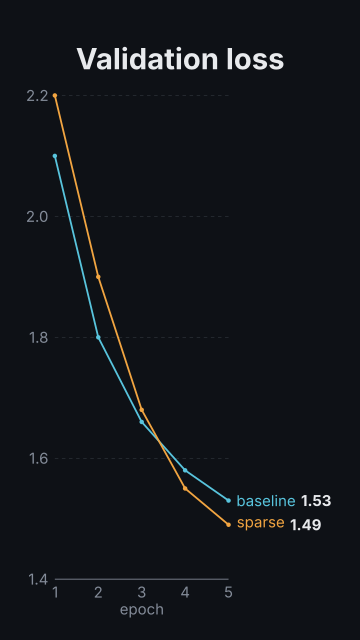

# `line_chart`

<!-- Generated by `vidgen gallery`; edit the sample in AGENTS.md (or video.yaml), not this file. -->

**Use it for:** change over time, trends.

`reveal: per_beat` (default): series *i* is drawn at beat *i* (the axes appear with the first one; spread evenly when there are more series than beats). `all`: every series is drawn in the first beat. Each series ends with a `name value` label.

Last beat, 16:9 and 9:16:

 

The scene playing (GIF, up to its last beat):

 

## YAML

From the author guide (`vidgen guide scenes`):

```yaml
- id: loss
  type: line_chart
  params:
    title: "Validation loss"
    x: [1, 2, 3, 4, 5]
    x_label: "epoch"
    series: {baseline: [2.1, 1.8, 1.66, 1.58, 1.53], sparse: [2.2, 1.9, 1.68, 1.55, 1.49]}
  beats:
    - text: "The baseline improves steadily."
    - text: "The sparse model starts slower, but ends lower."
```

## Params

| param | type | default | notes |
|---|---|---|---|
| `title` | `str` |  | Chart title (in the header band at the top). (also: heading) |
| `x` | `list[float] \| list[str]` | required | X values: increasing numbers, or category names. |
| `series` | `dict[str, list[float]] \| list[Series]` | required | {name: [values]} or a list of {name, values, color}; one value per x. |
| `series.name` | `str` | required | Series name (end label / legend). |
| `series.values` | `list[float]` | required | One value per x. |
| `series.color` | `color \| None` |  | Line color; default: the theme.palette color at the series' position. |
| `x_label` | `str` |  | X axis label. |
| `y_label` | `str` |  | Y axis label. |
| `y_min` | `float \| None` |  | Lower end of the y axis; default: from the data. |
| `y_max` | `float \| None` |  | Upper end of the y axis; default: from the data. |
| `value_format` | `str \| None` |  | Python format for y ticks and end labels; default: automatic. |
| `x_format` | `str` | `'{:g}'` | Python format for numeric x tick labels. |
| `unit` | `str` |  | Appended to y values. |
| `reveal` | `'per_beat' \| 'all'` | `'per_beat'` | per_beat: series i is drawn at beat i; all: every series in beat 1. |
| `annotate` | `bool` | `True` | Label the end of each line with its name and value. |
| `dots` | `bool \| None` |  | Markers at the data points; default: when there are at most 12 points. |
| `caption` | `str` |  | Note under the chart (e.g. the data source). |
| `caption_size` | `size` | `'caption'` | Caption text size. |
| `caption_color` | `color` | `'dim'` | Caption color. |
| `title_size` | `size` | `'heading'` | Title size (1.3x in a portrait frame). (also: heading_size) |
| `title_color` | `color` | `'text'` | Title color. (also: heading_color) |
| `label_size` | `size` | `'caption'` | Size of tick labels, axis labels, end labels and the legend (never below the readable minimum). |

## Targets

`title`, `axes`, `series<N>`, `series:<name>`, `point:<name>@<x>`

## Beats

Any number.

[All scene types](README.md) · `vidgen list-scenes` · `vidgen schema --scene line_chart`
