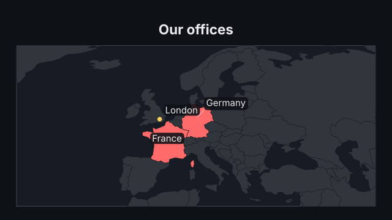
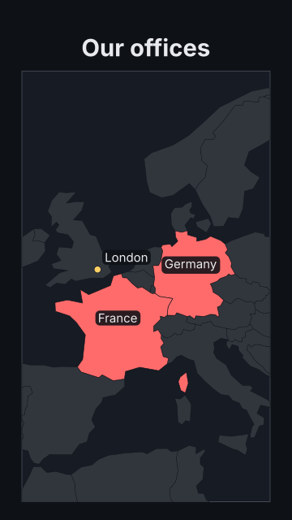

# `map`

<!-- Generated by `vidgen gallery`; edit the sample in AGENTS.md (or video.yaml), not this file. -->

**Use it for:** where in the world.

Beat 1 draws the map (a sweep from west to east, a choropleth's colours with it), the legend, the countries / pins / arcs given outside `steps` and then step 1; step *i* (an entry of `steps`) highlights its countries, drops its pins and draws its arcs at beat *i*. A step with `focus` moves the camera in on its items (the next step without it moves back; labels built for another view fade). More steps than beats are spread evenly; extra beats hold.

Last beat, 16:9 and 9:16:

 

The scene playing (GIF, up to its last beat):

 

## YAML

From the author guide (`vidgen guide scenes`):

```yaml
- id: offices
  type: map
  params:
    title: "Our offices"
    view: europe
    steps:
      - [Germany, France]
      - pins: [{lon: -0.13, lat: 51.51, label: London}]
  beats:
    - text: "We started in Germany and France."
    - text: "Then we opened in London."
```

## Params

| param | type | default | notes |
|---|---|---|---|
| `title` | `str` |  | Heading above the map. (also: heading) |
| `view` | `str \| list[float]` | `'auto'` | What the map shows: auto (fits the countries, pins and arcs; the world when there are none), world, europe, africa, asia, middle_east, north_america, south_america, oceania, or [lon_min, lat_min, lon_max, lat_max] (lon_max < lon_min crosses the date line). |
| `countries` | `list[str \| MapCountry]` |  | Countries highlighted with the map in beat 1. |
| `countries.country` | `str` | required | Name or ISO 3166 code (alpha-2 or alpha-3): Germany, DE, DEU; aliases such as USA, UK, Holland work. |
| `countries.color` | `color \| None` |  | Fill colour; default: the scene's highlight_color. |
| `countries.label` | `str \| bool \| None` |  | Its label: a text, true (its name) or false (none); default: the scene's labels. |
| `pins` | `list[MapPin]` |  | Pins shown with the map in beat 1. |
| `pins.lon` | `float \| None` |  | Longitude in degrees (east positive). |
| `pins.lat` | `float \| None` |  | Latitude in degrees (north positive). |
| `pins.country` | `str \| None` |  | Instead of lon / lat: put the pin in the middle of this country. |
| `pins.label` | `str` |  | Text beside the pin (arcs can start or end at a pin by its label). |
| `pins.color` | `color \| None` |  | Pin colour; default: the scene's pin_color. |
| `arcs` | `list[str \| MapArc]` |  | Arcs drawn with the map in beat 1. |
| `arcs.from` | `str \| list[float]` | required | Where it starts: a pin's label, a country (its middle) or [lon, lat]. |
| `arcs.to` | `str \| list[float]` | required | Where it ends (the arrowhead): a pin's label, a country or [lon, lat]. |
| `arcs.label` | `str` |  | Text at the top of the arc. |
| `arcs.color` | `color \| None` |  | Arc colour; default: the scene's arc_color. |
| `steps` | `list[list \| str \| MapStep]` |  | Step i at beat i: {countries, pins, arcs, focus}, a list of countries, or one country. |
| `steps.countries` | `list[str \| MapCountry]` |  | Countries highlighted at this step. |
| `steps.countries.country` | `str` | required | Name or ISO 3166 code (alpha-2 or alpha-3): Germany, DE, DEU; aliases such as USA, UK, Holland work. |
| `steps.countries.color` | `color \| None` |  | Fill colour; default: the scene's highlight_color. |
| `steps.countries.label` | `str \| bool \| None` |  | Its label: a text, true (its name) or false (none); default: the scene's labels. |
| `steps.pins` | `list[MapPin]` |  | Pins dropped at this step. |
| `steps.pins.lon` | `float \| None` |  | Longitude in degrees (east positive). |
| `steps.pins.lat` | `float \| None` |  | Latitude in degrees (north positive). |
| `steps.pins.country` | `str \| None` |  | Instead of lon / lat: put the pin in the middle of this country. |
| `steps.pins.label` | `str` |  | Text beside the pin (arcs can start or end at a pin by its label). |
| `steps.pins.color` | `color \| None` |  | Pin colour; default: the scene's pin_color. |
| `steps.arcs` | `list[str \| MapArc]` |  | Arcs drawn at this step. |
| `steps.arcs.from` | `str \| list[float]` | required | Where it starts: a pin's label, a country (its middle) or [lon, lat]. |
| `steps.arcs.to` | `str \| list[float]` | required | Where it ends (the arrowhead): a pin's label, a country or [lon, lat]. |
| `steps.arcs.label` | `str` |  | Text at the top of the arc. |
| `steps.arcs.color` | `color \| None` |  | Arc colour; default: the scene's arc_color. |
| `steps.focus` | `bool \| float` | `False` | Move the camera in on this step's countries, pins and arcs (labels stay readable); a number is the magnification (more than 1, up to 4), true: as close as fits, up to focus_scale. |
| `values` | `dict[str, float]` |  | Choropleth: a value per country ({Germany: 83, FR: 68}); countries are coloured by a colour scale with a legend. |
| `labels` | `bool` | `True` | Write the name of each highlighted country (a country's label overrides it). |
| `highlight_color` | `'palette' \| color` | `'accent'` | Fill of highlighted countries, or 'palette' (one theme palette colour per country); on a choropleth, the outline colour. |
| `land_color` | `color` | `'dim'` | Colour of the land (shown faint over the background). |
| `pin_color` | `color` | `'highlight'` | Default pin colour. |
| `arc_color` | `color` | `'highlight'` | Default arc colour. |
| `antarctica` | `bool` | `False` | Draw Antarctica (the world view then reaches the South Pole). |
| `scale` | `'auto' \| 'sequential' \| 'diverging'` | `'auto'` | Choropleth colour scale: sequential (low to high), diverging (two colours either side of center); auto: diverging when the values have both signs around center. |
| `color` | `color` | `'primary'` | Sequential scale: the colour of the highest values. |
| `low_color` | `color` | `'primary'` | Diverging scale: the colour below center. |
| `high_color` | `color` | `'accent'` | Diverging scale: the colour above center. |
| `center` | `float` | `0.0` | Diverging scale: the neutral middle value. |
| `scale_min` | `float \| None` |  | Value at the low end of the scale; default: the data's minimum (diverging: symmetric around center). |
| `scale_max` | `float \| None` |  | Value at the high end of the scale; default: the data's maximum. |
| `value_format` | `str \| None` |  | Python format for the legend ticks, e.g. '{:.1f}'; default: the decimals the values need. |
| `unit` | `str` |  | Appended to the legend ticks. |
| `legend` | `bool` | `True` | Show the choropleth's colour scale as a bar below the map. |
| `legend_label` | `str` |  | Title over the legend bar (what the colour means). |
| `label_size` | `size` | `'caption'` | Size of country, pin and arc labels (never below the readable size). |
| `focus_scale` | `float` | `3.0` | Largest magnification of focus: true. |
| `caption` | `str` |  | Note under the map (e.g. the data source). |
| `caption_size` | `size` | `'caption'` | Caption text size. |
| `caption_color` | `color` | `'dim'` | Caption color. |
| `title_size` | `size` | `'heading'` | Title size (1.3x in a portrait frame). (also: heading_size) |
| `title_color` | `color` | `'text'` | Title color. (also: heading_color) |

## Targets

`title`, `map`, `legend`, `country:<code>`, `pin<N>`, `pin:<label>`, `arc<N>`, `step<N>`

## Beats

Any number.

[All scene types](README.md) · `vidgen list-scenes` · `vidgen schema --scene map`
