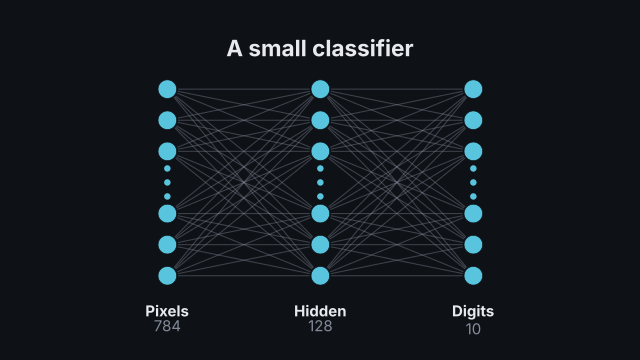
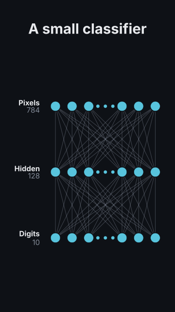

# `network`

<!-- Generated by `vidgen gallery`; edit the sample in AGENTS.md (or video.yaml), not this file. -->

**Use it for:** a neural network.

A layered neural network: layers of units (left to right in 16:9, top to bottom in 9:16) joined by edges — dense, sparse, grouped or one to one. A large layer shows a few units, an ellipsis and its count. Steps: one layer per step (the edges into it grow first), then `passes` forward passes (a pulse runs through the network layer by layer), then the `highlight` step (a path of units stands out, the rest dims).

Last beat, 16:9 and 9:16:

 

The scene playing (GIF, up to its last beat):

 

## YAML

From the author guide (`vidgen guide scenes`):

```yaml
- id: mlp
  type: network
  params:
    heading: "A small classifier"
    layers: [{size: 784, label: "Pixels"}, {size: 128, label: "Hidden"}, {size: 10, label: "Digits"}]
  beats:
    - text: "Every pixel is an input."
    - text: "A hidden layer combines them."
    - text: "Ten outputs score the ten digits."
    - text: "A forward pass flows from left to right."
```

## Params

| param | type | default | notes |
|---|---|---|---|
| `layers` | `list[int \| NetLayer]` | required | The layers from input to output: a size, or {size, label?, show?, connect?, color?} (2-8). |
| `layers.size` | `int` | required | Number of units the layer has (a layer larger than max_neurons is drawn as `show` units and an ellipsis). |
| `layers.label` | `str` |  | Name under the layer ('Input', 'Hidden', 'Output'). |
| `layers.show` | `int \| None` |  | Units drawn when the layer is larger than max_neurons (default: the scene's show). |
| `layers.connect` | `str \| Connection \| None` |  | How this layer connects to the previous one (default: the scene's connect). |
| `layers.connect.type` | `'dense' \| 'sparse' \| 'grouped' \| 'one_to_one' \| 'none'` | `'dense'` | dense: every unit to every unit; sparse: a share of the pairs; grouped: blocks connected block to block; one_to_one: unit to unit; none. |
| `layers.connect.ratio` | `float` | `0.35` | Share of the pairs drawn for sparse. |
| `layers.connect.groups` | `int` | `2` | Number of blocks for grouped (each block of one layer connects to the same block of the other). |
| `layers.color` | `color \| None` |  | Colour of this layer's units (default: the scene's neuron_color). |
| `heading` | `str` |  | Optional heading above the network. (also: title) |
| `connect` | `str \| Connection` | `'dense'` | How each layer connects to the previous one unless the layer says otherwise: dense, sparse, grouped, one_to_one, none, or 'sparse:0.3' / 'grouped:3' / {type, ratio, groups}. |
| `connect.type` | `'dense' \| 'sparse' \| 'grouped' \| 'one_to_one' \| 'none'` | `'dense'` | dense: every unit to every unit; sparse: a share of the pairs; grouped: blocks connected block to block; one_to_one: unit to unit; none. |
| `connect.ratio` | `float` | `0.35` | Share of the pairs drawn for sparse. |
| `connect.groups` | `int` | `2` | Number of blocks for grouped (each block of one layer connects to the same block of the other). |
| `direction` | `'auto' \| 'LR' \| 'TB'` | `'auto'` | LR: layers left to right; TB: top to bottom; auto: TB in portrait frames, else LR. |
| `max_neurons` | `int` | `8` | Layers with more units than this are drawn as `show` units with an ellipsis. |
| `show` | `int` | `6` | Units drawn for a large layer (half before the ellipsis, half after). |
| `counts` | `'auto' \| 'all' \| 'none'` | `'auto'` | Unit counts under the layer labels: auto: for layers drawn with an ellipsis; all; none. |
| `count_format` | `str` | `'{n:,}'` | Format of the counts (Python format with n: '{n:,} units', '{n}'). |
| `reveal` | `'layers' \| 'all'` | `'layers'` | layers: one layer per step, its incoming edges first; all: the whole network in step 1. |
| `passes` | `int` | `1` | Forward passes after the network is built: each is a step in which a pulse runs from the first layer to the last. |
| `highlight` | `list[str] \| str` |  | Units emphasised in a last step, as 'layer.unit' (1-based, units as drawn): ['1.2', '2.3', '3.1'] marks a path; the rest dims. |
| `max_edges` | `int` | `64` | Most edges drawn between two layers (more are thinned evenly, keeping every unit connected). |
| `neuron_color` | `color` | `'primary'` | Units (unless a layer sets its color). |
| `edge_color` | `color` | `'dim'` | Edges (grouped edges use the palette instead, see group_colors). |
| `group_colors` | `bool` | `True` | Colour grouped connections by block (theme palette). |
| `edge_opacity` | `float \| None` |  | Edge opacity; default: lower the more edges a pair of layers has. |
| `label_color` | `color` | `'text'` | Layer labels. |
| `count_color` | `color` | `'dim'` | Unit counts. |
| `pulse_color` | `color` | `'accent'` | The forward-pass pulse. |
| `highlight_color` | `color` | `'highlight'` | Highlighted units and the edges between them. |
| `heading_color` | `color` | `'text'` | Heading colour. (also: title_color) |
| `label_size` | `size` | `'caption'` | Layer label size (counts use it too; never below the readable minimum). |
| `heading_size` | `size` | `'heading'` | Heading size. (also: title_size) |

## Targets

`heading`, `layer<N>`, `layer:<label>`, `edges<N>`, `neuron<L>.<i>`

## Beats

Any number.

[All scene types](README.md) · `vidgen list-scenes` · `vidgen schema --scene network`
