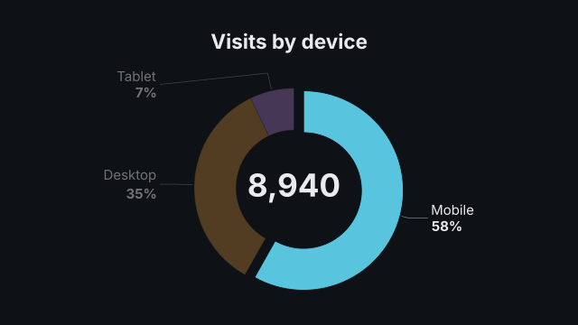
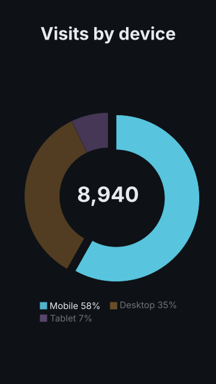
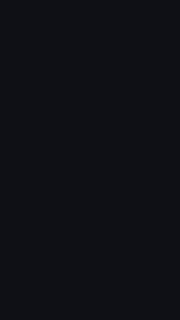

# `pie`

<!-- Generated by `vidgen gallery`; edit the sample in AGENTS.md (or video.yaml), not this file. -->

**Use it for:** parts of a whole (≤ 6 parts).

A pie (or, with `donut: true`, a ring with the total in its hole). `reveal: all` (default) sweeps every slice round in beat 1, then writes their labels; `per_beat` sweeps slice *i* in at beat *i*. With `highlight` set, a last step pulls that slice out of the pie and dims the others.

Last beat, 16:9 and 9:16:

 

The scene playing (GIF, up to its last beat):

 

## YAML

From the author guide (`vidgen guide scenes`):

```yaml
- id: devices
  type: pie
  params: {title: "Visits by device", donut: true, labels: ["Mobile", "Desktop", "Tablet"], values: [5200, 3100, 640], highlight: Mobile}
  beats:
    - text: "Most visits come from phones."
    - text: "More than half of them."
```

## Params

| param | type | default | notes |
|---|---|---|---|
| `labels` | `list[str]` | required | Slice names (unique). |
| `values` | `list[float]` | required | One value per label (0 or more); each slice's share is its value / the total. |
| `title` | `str` |  | Chart title (in the header band at the top). (also: heading) |
| `donut` | `bool` | `False` | Draw a ring instead of a full pie, with the total (or center) in the hole. |
| `hole` | `float` | `0.58` | Donut hole radius as a share of the outer radius. |
| `center` | `str \| None` |  | Text in the donut hole; default: the total (value_format and unit); "" leaves it empty. |
| `center_label` | `str` |  | A smaller line under the centre text (e.g. 'visits'). |
| `show_values` | `'percent' \| 'value' \| 'both' \| 'none'` | `'percent'` | What each label shows under its name: the share (42%), the value, both (42% · 1,200) or nothing. |
| `value_format` | `str \| None` |  | Python format for values (and the total), e.g. '{:,.0f}'; default: the decimals they need. |
| `unit` | `str` |  | Appended to values (and the total), e.g. ' GB'. |
| `percent_decimals` | `int \| None` |  | Decimals of the shares; default 0, or 1 when a slice is under 1 %. |
| `colors` | `'palette' \| color \| list[color]` | `'palette'` | 'palette' (theme.palette in order, lighter shades when there are more slices than colours), one color, or one per label. |
| `sort` | `bool` | `False` | Draw the slices from largest to smallest (else in the order written). |
| `other_below` | `float \| None` |  | Group slices smaller than this share (%) into one other_label slice, drawn last. |
| `max_slices` | `int \| None` |  | Keep the largest max_slices - 1 slices and group the rest into one other_label slice. |
| `other_label` | `str` | `'Other'` | Name of the grouped slice. |
| `other_color` | `color` | `'dim'` | Color of the grouped slice. |
| `label_position` | `'auto' \| 'outside'` | `'auto'` | auto: inside a slice when the label fits there, else outside with a leader line; outside: always outside. |
| `legend` | `bool \| None` |  | Names in a legend beside the pie (below it in 9:16) instead of at the slices; default: with more than 6 slices. |
| `reveal` | `'all' \| 'per_beat'` | `'all'` | all: every slice sweeps in during beat 1; per_beat: slice i at beat i. |
| `highlight` | `int \| str \| None` |  | Slice pulled out in a last step (0-based index or label, as drawn); the others dim. |
| `explode` | `float` | `0.1` | How far the highlighted slice moves out, as a share of the radius. |
| `start_angle` | `float` | `90` | Where the first slice starts, in degrees (90: at the top; 0: at the right). |
| `clockwise` | `bool` | `True` | Slices follow each other clockwise. |
| `label_size` | `size` | `'caption'` | Size of slice labels and the legend (never below the readable minimum; shrinks towards it when labels do not fit). |
| `center_size` | `size` | `'title'` | Size of the donut's centre text (fitted into the hole). |
| `caption` | `str` |  | Note under the chart (e.g. the data source). |
| `caption_size` | `size` | `'caption'` | Caption text size. |
| `caption_color` | `color` | `'dim'` | Caption color. |
| `title_size` | `size` | `'heading'` | Title size (1.3x in a portrait frame). (also: heading_size) |
| `title_color` | `color` | `'text'` | Title color. (also: heading_color) |

## Targets

`title`, `slice<N>`, `slice:<label>`, `center`, `legend`

## Beats

Any number.

[All scene types](README.md) · `vidgen list-scenes` · `vidgen schema --scene pie`
