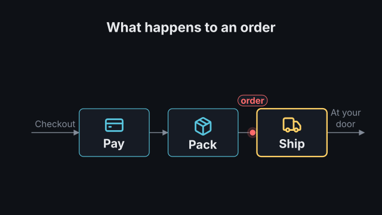
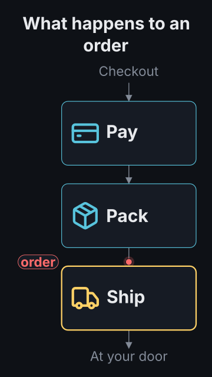

# `process`

<!-- Generated by `vidgen gallery`; edit the sample in AGENTS.md (or video.yaml), not this file. -->

**Use it for:** something moving through stages.

A pipeline of 2-8 stages, left to right in 16:9 (two rows, snaking, for many stages) and top to bottom in 9:16. Each step reveals the next stage: the connector into it grows while a token travels along it, and the stage becomes the active one (outline and icon in `active_color`). `loop` adds a last step: an arrow back to the first stage, which the token follows. `reveal: all` shows the whole pipeline in beat 1 and then only moves the token, one stage per step.

Last beat, 16:9 and 9:16:

 

The scene playing (GIF, up to its last beat):

 

## YAML

From the author guide (`vidgen guide scenes`):

```yaml
- id: order
  type: process
  params:
    heading: "What happens to an order"
    input: "Checkout"
    output: "At your door"
    token_label: "order"
    stages: [{label: "Pay", icon: credit-card}, {label: "Pack", icon: package}, {label: "Ship", icon: truck}]
  beats:
    - text: "At checkout, the order is paid."
    - text: "The warehouse packs it."
    - text: "And a courier brings it to your door."
```

## Params

| param | type | default | notes |
|---|---|---|---|
| `stages` | `list[str \| ProcessStage]` | required | The stages in order: a label, or {label, icon?, text?} (2-8; 3-5 read best). |
| `stages.label` | `str` | required | Name of the stage (short; wrapped to fit the card). |
| `stages.icon` | `icon \| None` |  | Optional icon on the stage's card. |
| `stages.text` | `str` |  | Optional detail line under the label, smaller and dimmer. |
| `heading` | `str` |  | Optional heading above the pipeline. (also: title) |
| `layout` | `'auto' \| 'row' \| 'snake' \| 'column'` | `'auto'` | row: left to right; snake: two rows, the second running back; column: top to bottom. auto: column in portrait, else a row (snake when that keeps the text clearly larger). |
| `reveal` | `'per_beat' \| 'all'` | `'per_beat'` | per_beat: one stage per step, the token following; all: the whole pipeline in step 1, then the token moves one stage per step. |
| `loop` | `bool` | `False` | Draw an arrow from the last stage back to the first (a cycle); the token follows it in a last step. |
| `loop_label` | `str` |  | Optional text on the loop arrow ('repeat', 'next batch'). |
| `input` | `str` |  | Optional label before the first stage (what goes in), with an arrow into it. |
| `output` | `str` |  | Optional label after the last stage (what comes out), with an arrow from it. |
| `token` | `bool` | `True` | Show the moving token (a dot) that travels from stage to stage. |
| `token_icon` | `icon \| None` |  | Draw the token as this icon in a small disc instead of a dot. |
| `token_label` | `str` |  | Optional short tag that travels with the token ('order', 'request'). |
| `stage_color` | `color` | `'primary'` | Stage outlines and icons. |
| `label_color` | `color` | `'text'` | Stage labels. |
| `text_color` | `color` | `'dim'` | Stage detail lines. |
| `connector_color` | `color` | `'dim'` | Connectors and the loop arrow. |
| `active_color` | `color` | `'highlight'` | Outline and icon of the active stage (where the token is). |
| `token_color` | `color` | `'accent'` | The token and its tag. |
| `io_color` | `color` | `'dim'` | Input, output and loop labels. |
| `heading_color` | `color` | `'text'` | Heading colour. (also: title_color) |
| `size` | `size` | `'body'` | Stage label size (up to 1.2x larger when there is room; reduced together with the other sizes, not below the readable minimum, when space is short). |
| `text_size` | `size` | `'caption'` | Stage detail size. |
| `io_size` | `size` | `'caption'` | Size of the input, output, loop and token labels. |
| `heading_size` | `size` | `'heading'` | Heading size. (also: title_size) |

## Targets

`heading`, `input`, `stage<N>`, `stage:<label>`, `connector<N>`, `loop`, `output`, `token`

## Beats

Any number.

[All scene types](README.md) · `vidgen list-scenes` · `vidgen schema --scene process`
