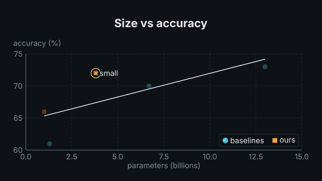
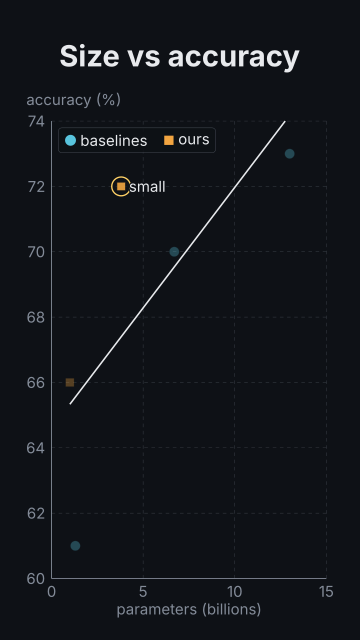

# `scatter`

<!-- Generated by `vidgen gallery`; edit the sample in AGENTS.md (or video.yaml), not this file. -->

**Use it for:** a relationship between two measures.

`reveal: series` (default): series *i* appears at beat *i* (the axes with the first), its points popping in from left to right; `groups`: the points of each `group` appear together, one group per beat; `all`: every point in beat 1. A `trend` line adds a step (it grows from left to right, with its equation / R² if asked), and `highlight` a last one (the chosen points get a ring, the others dim).

Last beat, 16:9 and 9:16:

 

The scene playing (GIF, up to its last beat):

 

## YAML

From the author guide (`vidgen guide scenes`):

```yaml
- id: size_vs_accuracy
  type: scatter
  params:
    title: "Size vs accuracy"
    x_label: "parameters (billions)"
    y_label: "accuracy (%)"
    trend: all
    series: {baselines: [[1.3, 61], [6.7, 70], [13, 73]], ours: [[1.0, 66], [3.8, 72, "small"]]}
    highlight: "ours@small"
  beats:
    - text: "Bigger baselines score higher."
    - text: "Ours sit above the line."
    - text: "The trend makes the gap clear."
    - text: "Especially for the small one."
```

## Params

| param | type | default | notes |
|---|---|---|---|
| `series` | `dict[str, list[list \| ScatterPoint]] \| list[ScatterSeries]` | required | {name: [points]} or a list of {name, points, color, marker}; a point is [x, y], [x, y, label] or {x, y, label, group}. |
| `series.x` | `float` | required | Horizontal value. |
| `series.y` | `float` | required | Vertical value. |
| `series.label` | `str` |  | Name written beside the point (see show_labels); also names its target point:<series>@<label>. |
| `series.group` | `str \| int \| None` |  | Reveal group (reveal: groups): points of one group appear together, groups in order of first use. |
| `series.name` | `str` | required | Series name (legend, targets series:<name>). |
| `series.points` | `list[list \| ScatterPoint]` | required | The points: [x, y], [x, y, label] or {x, y, label, group}. |
| `series.points.x` | `float` | required | Horizontal value. |
| `series.points.y` | `float` | required | Vertical value. |
| `series.points.label` | `str` |  | Name written beside the point (see show_labels); also names its target point:<series>@<label>. |
| `series.points.group` | `str \| int \| None` |  | Reveal group (reveal: groups): points of one group appear together, groups in order of first use. |
| `series.color` | `color \| None` |  | Marker color; default: the theme.palette color at the series' position. |
| `series.marker` | `'auto' \| 'circle' \| 'square' \| 'triangle' \| 'diamond'` | `'auto'` | Marker shape; auto: circle, square, triangle, diamond by series position (tells series apart without colour). |
| `title` | `str` |  | Chart title (in the header band at the top). (also: heading) |
| `x_label` | `str` |  | X axis label. |
| `y_label` | `str` |  | Y axis label. |
| `x_min` | `float \| None` |  | Left end of the x axis; default: from the data (rounded out to a tick). |
| `x_max` | `float \| None` |  | Right end of the x axis; default: from the data. |
| `y_min` | `float \| None` |  | Lower end of the y axis; default: from the data. |
| `y_max` | `float \| None` |  | Upper end of the y axis; default: from the data. |
| `x_log` | `bool` | `False` | Logarithmic x axis (positive values only; ticks at powers of ten). |
| `y_log` | `bool` | `False` | Logarithmic y axis. |
| `x_format` | `str \| None` |  | Python format for x tick labels, e.g. '{:.1f}'; default: automatic (12k, 3.4M for large numbers). |
| `y_format` | `str \| None` |  | Python format for y tick labels; default: automatic. |
| `x_unit` | `str` |  | Appended to x tick labels. |
| `y_unit` | `str` |  | Appended to y tick labels. |
| `trend` | `'none' \| 'each' \| 'all'` | `'none'` | Least-squares trend line: none, one per series (each), or one through every point (all); drawn in a step of its own. |
| `trend_label` | `'none' \| 'equation' \| 'r2' \| 'both'` | `'none'` | Text at the trend line: its equation (y = ax + b), R², or both. |
| `trend_color` | `color \| None` |  | Trend line color; default: the series color (each), text (all). |
| `reveal` | `'series' \| 'groups' \| 'all'` | `'series'` | series: one series per beat; groups: the points of each group per beat (points without a group come first); all: everything in beat 1. |
| `show_labels` | `'all' \| 'highlight' \| 'none'` | `'all'` | Which point labels are written: every labelled point, only highlighted ones (in the highlight step), or none. |
| `highlight` | `list[str] \| str` |  | Points emphasised in a last step: '<series>@<N>' (1-based), '<series>@<label>' or a label; the others dim. |
| `highlight_color` | `color` | `'highlight'` | Ring color of highlighted points. |
| `legend` | `bool \| None` |  | Legend of the series (placed where it covers no points); default: with more than one series. |
| `point_radius` | `float \| None` |  | Marker radius in Manim units; default: from the number of points (0.11 to 0.05). |
| `label_size` | `size` | `'caption'` | Size of tick labels, axis labels, point labels, the legend and the trend text (never below the readable minimum). |
| `caption` | `str` |  | Note under the chart (e.g. the data source). |
| `caption_size` | `size` | `'caption'` | Caption text size. |
| `caption_color` | `color` | `'dim'` | Caption color. |
| `title_size` | `size` | `'heading'` | Title size (1.3x in a portrait frame). (also: heading_size) |
| `title_color` | `color` | `'text'` | Title color. (also: heading_color) |

## Targets

`title`, `axes`, `legend`, `series<N>`, `series:<name>`, `point:<series>@<N>`, `point:<series>@<label>`, `trend`, `trend:<series>`

## Beats

Any number.

[All scene types](README.md) · `vidgen list-scenes` · `vidgen schema --scene scatter`
