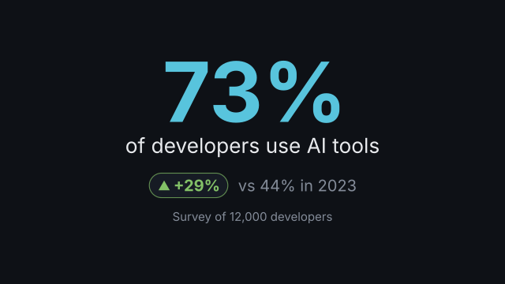
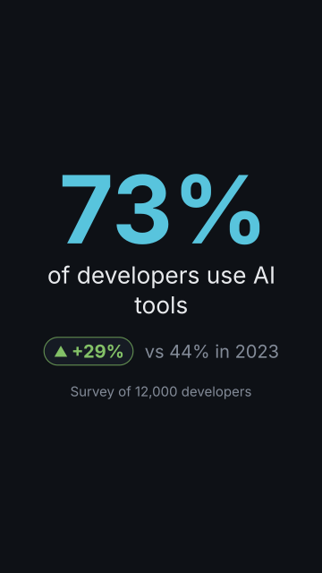

# `stat`

<!-- Generated by `vidgen gallery`; edit the sample in AGENTS.md (or video.yaml), not this file. -->

**Use it for:** one number that matters.

Beat 1 reveals the icon, the value (counting up) and the label; beat 2 the comparison and the context line (everything in beat 1 when there is only one); further beats hold.

Last beat, 16:9 and 9:16:

 

The scene playing (GIF, up to its last beat):

 

## YAML

From the author guide (`vidgen guide scenes`):

```yaml
- id: users
  type: stat
  params:
    value: 73
    suffix: "%"
    label: "of developers use AI tools"
    comparison: {value: 44, label: "in 2023"}
    context: "Survey of 12,000 developers"
  beats:
    - text: "Almost three in four developers now use AI tools."
    - text: "Two years ago, it was not even half."
```

## Params

| param | type | default | notes |
|---|---|---|---|
| `value` | `float` | required | The number shown. |
| `label` | `str` |  | What the number is, under it (e.g. 'of developers use AI tools'). |
| `context` | `str` |  | A smaller line at the bottom: period, population, source. |
| `prefix` | `str` |  | Before the number, same size (e.g. '$'). |
| `suffix` | `str` |  | After the number, same size (e.g. '%', 'x', 'k'). |
| `unit` | `str` |  | After the number, smaller, on its baseline (e.g. 'ms', 'users'). |
| `decimals` | `int \| None` |  | Decimals shown (also while counting); default: what value and comparison need, up to 2. |
| `thousands` | `str` | `','` | Thousands separator: ',', '.', ' ', "'" or '' for none. |
| `decimal_mark` | `str` | `'.'` | Decimal mark: '.' or ','. |
| `count` | `bool` | `True` | Count up to the value in beat 1; false: the value fades in. |
| `count_from` | `float \| None` |  | Where the count starts; default 0, or the comparison value with kind: before. |
| `comparison` | `float \| StatComparison \| None` |  | Optional value to compare with: a number or {value, label, kind, word, delta, better}. |
| `comparison.value` | `float` | required | The other value (same prefix, suffix and unit as the stat). |
| `comparison.label` | `str` |  | Words after the other value, e.g. 'last year'. |
| `comparison.kind` | `'versus' \| 'before'` | `'versus'` | versus: 'vs 12%'; before: the stat counts up from this value ('from 12%'). |
| `comparison.word` | `str \| None` |  | Word before the other value; default 'vs' (versus) or 'from' (before); '' for none. |
| `comparison.delta` | `'difference' \| 'percent' \| 'none'` | `'difference'` | The change shown in a coloured chip with an arrow: the difference (+19%), the percent change (+158%), or none. |
| `comparison.better` | `'higher' \| 'lower' \| 'neither'` | `'higher'` | Which direction is good: colours the chip with good_color / bad_color (neither: neutral_color). |
| `icon` | `icon \| None` |  | Optional icon above the number. |
| `icon_color` | `color` | `'primary'` | Icon color. |
| `color` | `color` | `'primary'` | Color of the number (prefix, suffix and unit too). |
| `label_color` | `color` | `'text'` | Label color. |
| `context_color` | `color` | `'dim'` | Context line color. |
| `comparison_color` | `color` | `'dim'` | Color of the comparison text ('vs 12% last year'). |
| `good_color` | `color` | `'tertiary'` | Change chip color when the change goes the better way. |
| `bad_color` | `color` | `'accent'` | Change chip color when the change goes the worse way. |
| `neutral_color` | `color` | `'dim'` | Change chip color for no change or better: neither. |
| `size` | `size \| None` |  | Number size; default 3x the theme's title size (shrunk to fit the frame). |
| `label_size` | `size` | `'subtitle'` | Label text size. |
| `context_size` | `size` | `'caption'` | Context line text size. |
| `comparison_size` | `size` | `'body'` | Comparison text size. |

## Targets

`icon`, `value`, `label`, `comparison`, `context`

## Beats

Any number.

[All scene types](README.md) · `vidgen list-scenes` · `vidgen schema --scene stat`
