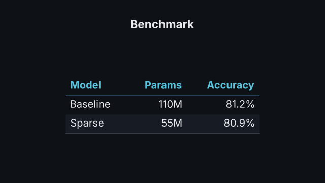
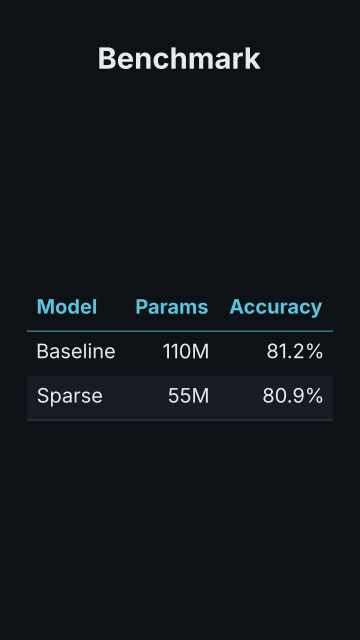

# `table`

<!-- Generated by `vidgen gallery`; edit the sample in AGENTS.md (or video.yaml), not this file. -->

**Use it for:** exact values to compare across attributes.

`reveal: per_beat` (default): the header (with title and caption) and row 1 appear at beat 1, row *i* at beat *i*; with more rows than beats they are spread evenly, extra beats hold. `reveal: all`: the whole table in beat 1.

Last beat, 16:9 and 9:16:

 

The scene playing (GIF, up to its last beat):

 

## YAML

From the author guide (`vidgen guide scenes`):

```yaml
- id: results
  type: table
  params:
    title: "Benchmark"
    header: ["Model", "Params", "Accuracy"]
    rows: [["Baseline", 110, 0.812], ["Sparse", 55, 0.809]]
    number_format: [null, "{:,.0f}M", "{:.1%}"]
  beats:
    - text: "The baseline has a hundred and ten million parameters."
    - text: "The sparse one has half, at the same accuracy."
```

## Params

| param | type | default | notes |
|---|---|---|---|
| `rows` | `list[list[str \| int \| float]]` | required | The body rows (up to 30), each a list of cells: text or numbers. |
| `header` | `list[str]` |  | Column headings (optional); sets the number of columns. |
| `title` | `str` |  | Title above the table. (also: heading) |
| `caption` | `str` |  | Note under the table (e.g. the source). |
| `align` | `'auto' \| 'left' \| 'center' \| 'right' \| list['auto' \| 'left' \| 'center' \| 'right']` | `'auto'` | Alignment of every column or one per column: auto (numbers right, text left), left, center, right. |
| `number_format` | `str \| list[str \| None] \| None` |  | Python format for numbers ('{:,.1f}', '{:.0%}', '${:,.0f}'), one for all or one per column; default: the decimals each column needs, with thousands separators. |
| `reveal` | `'per_beat' \| 'all'` | `'per_beat'` | per_beat: header and row 1 in beat 1, then one row per beat; all: everything in beat 1. |
| `zebra` | `bool` | `True` | Stripe every other row with stripe_color. |
| `color` | `color` | `'text'` | Cell text colour. |
| `header_color` | `color` | `'primary'` | Header text and rule colour. |
| `stripe_color` | `color` | `'surface'` | Colour of the zebra stripes. |
| `rule_color` | `color` | `'dim'` | Colour of the thin rule under the last row. |
| `title_color` | `color` | `'text'` | Title colour. (also: heading_color) |
| `caption_color` | `color` | `'dim'` | Caption colour. |
| `size` | `size` | `'body'` | Cell text size (text columns wrap and the size is reduced, not below the readable minimum, to fit). |
| `title_size` | `size` | `'heading'` | Title size. (also: heading_size) |
| `caption_size` | `size` | `'caption'` | Caption size. |

## Targets

`title`, `header`, `row<N>`, `row:<first cell>`, `col<N>`, `col:<header>`, `cell<R>.<C>`, `caption`

## Beats

Any number.

[All scene types](README.md) · `vidgen list-scenes` · `vidgen schema --scene table`
