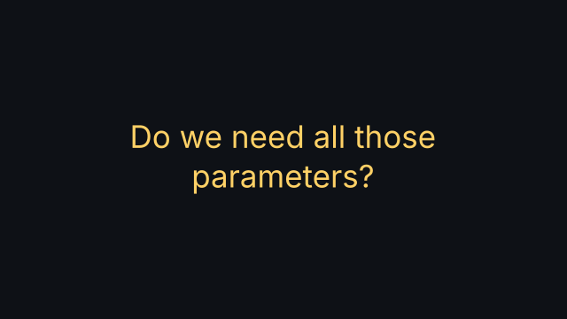
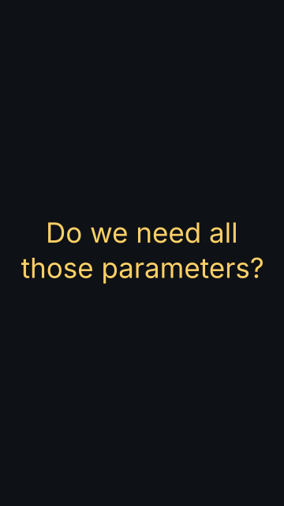

# `text_card`

<!-- Generated by `vidgen gallery`; edit the sample in AGENTS.md (or video.yaml), not this file. -->

**Use it for:** one statement or question, big.

Fades in `text` (wrapped to fit the frame) and keeps it on screen while the beats are narrated; no fade-out at the end.

Last beat, 16:9 and 9:16:

 

The scene playing (GIF, up to its last beat):

 

## YAML

From the author guide (`vidgen guide scenes`):

```yaml
- id: question
  type: text_card
  params: {text: "Do we need all those parameters?", color: highlight}
  beats: [{text: "So do we really need all of them?"}]
```

## Params

| param | type | default | notes |
|---|---|---|---|
| `text` | `str` | required | The text, wrapped to fit the frame. |
| `size` | `size` | `'title'` | Text size. |
| `color` | `color` | `'text'` | Text color. |

## Targets

`text`

## Beats

Any number.

[All scene types](README.md) · `vidgen list-scenes` · `vidgen schema --scene text_card`
