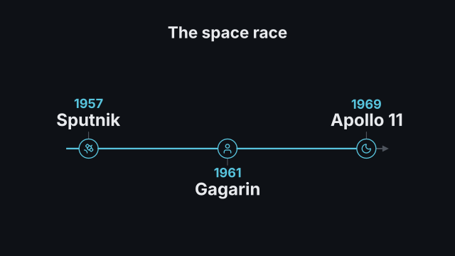
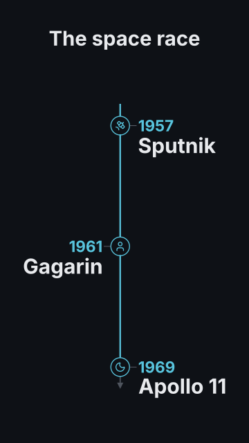

# `timeline`

<!-- Generated by `vidgen gallery`; edit the sample in AGENTS.md (or video.yaml), not this file. -->

**Use it for:** what happened when.

Events along a horizontal axis (16:9, square) or a vertical one (9:16), alternating sides of it. Step 1 draws the heading and the axis, then each step reveals the next event while a progress line grows to it (one event per beat; with more events than beats they are spread evenly). A `highlight` adds a last step that dims the other events. `reveal: all` shows every event in beat 1.

Last beat, 16:9 and 9:16:

 

The scene playing (GIF, up to its last beat):

 

## YAML

From the author guide (`vidgen guide scenes`):

```yaml
- id: history
  type: timeline
  params:
    heading: "The space race"
    events:
      - {date: 1957, title: "Sputnik", icon: satellite}
      - {date: 1961, title: "Gagarin", icon: user}
      - {date: 1969, title: "Apollo 11", icon: moon}
  beats:
    - text: "In 1957, the first satellite, Sputnik, reached orbit."
    - text: "Four years later, Gagarin flew."
    - text: "And in 1969, people walked on the Moon."
```

## Params

| param | type | default | notes |
|---|---|---|---|
| `events` | `list[TimelineEvent]` | required | The events in time order, {date, title, text?, icon?, at?} (2-10; 3-6 read best). |
| `events.date` | `str \| int \| float` | required | The date or label shown above the title ('1969', 'March 2024', 'Phase 1'). |
| `events.title` | `str` | required | What happened (wrapped to fit). (also: heading) |
| `events.text` | `str` |  | Optional detail line under the title, smaller and dimmer. |
| `events.icon` | `icon \| None` |  | Optional icon in the event's marker on the axis. |
| `events.at` | `float \| None` |  | Position for spacing: proportional; default: the date when it is a number, a year, YYYY-MM or YYYY-MM-DD. |
| `heading` | `str` |  | Optional heading above the timeline. (also: title) |
| `orientation` | `'auto' \| 'horizontal' \| 'vertical'` | `'auto'` | auto: a horizontal axis in landscape and square frames, a vertical one in portrait. |
| `sides` | `'auto' \| 'alternate' \| 'one'` | `'auto'` | Events alternate sides of the axis, or all stand on one side (below / right); auto: the layout that keeps text largest. |
| `spacing` | `'even' \| 'proportional'` | `'even'` | even: equal gaps; proportional: gaps follow the dates (numbers, years, YYYY-MM(-DD)) or each event's at. |
| `reveal` | `'per_beat' \| 'all'` | `'per_beat'` | per_beat: one event per beat; all: every event in beat 1. |
| `highlight` | `int \| str \| None` |  | Event emphasised in a last step (0-based index, or its date or title); the others dim. |
| `now` | `int \| str \| None` |  | The present (0-based index, or date or title): that event gets a now_label tag; later ones are drawn as planned (hollow markers, dashed progress). |
| `now_label` | `str` | `'Now'` | Text of the tag on the `now` event. |
| `color` | `color` | `'text'` | Event title colour. |
| `date_color` | `color` | `'primary'` | Date colour. |
| `text_color` | `color` | `'dim'` | Detail text colour. |
| `marker_color` | `color` | `'primary'` | Markers and their icons. |
| `axis_color` | `color` | `'dim'` | The axis line (drawn faint). |
| `progress_color` | `color` | `'primary'` | The progress line that grows to each event. |
| `heading_color` | `color` | `'text'` | Heading colour. (also: title_color) |
| `highlight_color` | `color` | `'highlight'` | Marker and title colour of the highlighted event. |
| `now_color` | `color` | `'accent'` | Colour of the now tag and the ring around the now marker. |
| `size` | `size` | `'body'` | Event title size (up to 1.2x larger when every event has room; reduced together, not below the readable minimum, when space is short). |
| `date_size` | `size` | `'caption'` | Date size. |
| `text_size` | `size` | `'caption'` | Detail text size. |
| `heading_size` | `size` | `'heading'` | Heading size. (also: title_size) |

## Targets

`heading`, `axis`, `event<N>`, `event:<date>`

## Beats

Any number.

[All scene types](README.md) · `vidgen list-scenes` · `vidgen schema --scene timeline`
