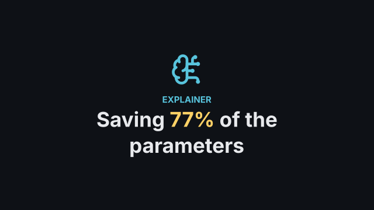
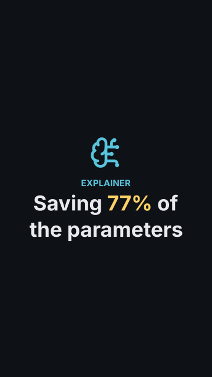
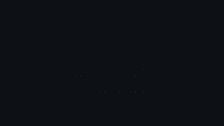
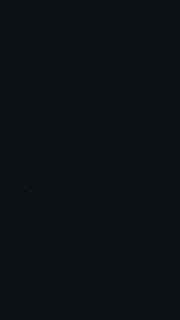

# `title`

<!-- Generated by `vidgen gallery`; edit the sample in AGENTS.md (or video.yaml), not this file. -->

**Use it for:** the title, who made it.

Beat 1 reveals the icon, kicker, title and subtitle; beat 2 reveals the authors (if any).

Last beat, 16:9 and 9:16:

 

The scene playing (GIF, up to its last beat):

 

## YAML

From the author guide (`vidgen guide scenes`):

```yaml
- id: opening
  type: title
  params: {kicker: "EXPLAINER", title: "Saving 77% of the parameters", highlight: "77%", icon: brain-circuit}
  beats: [{text: "What if most of a model could simply go?"}]
```

## Params

| param | type | default | notes |
|---|---|---|---|
| `title` | `str` | required | Main title; wrapped to fit, may contain line breaks. |
| `subtitle` | `str` |  | Line under the title. |
| `kicker` | `str` |  | Small label above the title. |
| `authors` | `list[str]` |  | One line each, revealed in beat 2. |
| `highlight` | `str` |  | Part of the title drawn in highlight_color. |
| `color` | `color` | `'text'` | Title color. |
| `highlight_color` | `color` | `'highlight'` | Color of the highlighted part of the title. |
| `subtitle_color` | `color` | `'text'` | Subtitle color. |
| `kicker_color` | `color` | `'primary'` | Kicker color. |
| `authors_color` | `color` | `'dim'` | Authors color. |
| `icon` | `icon \| None` |  | Optional icon above (or left of) the title. |
| `icon_color` | `color` | `'primary'` | Icon color. |
| `icon_position` | `'above' \| 'left'` | `'above'` | above the kicker/title, or left of the title block (above in a vertical frame). |

## Targets

`icon`, `kicker`, `title`, `subtitle`, `authors`

## Beats

Any number.

[All scene types](README.md) · `vidgen list-scenes` · `vidgen schema --scene title`
