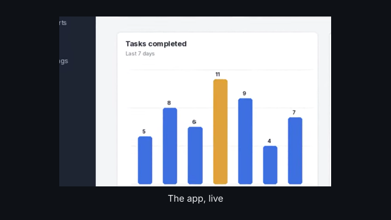
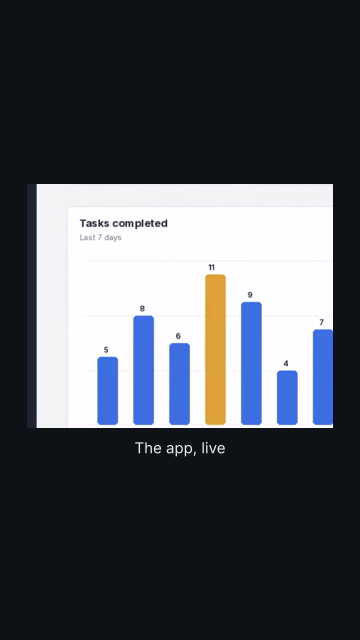

# `video_clip`

<!-- Generated by `vidgen gallery`; edit the sample in AGENTS.md (or video.yaml), not this file. -->

**Use it for:** footage, a screen recording.

Beat 1 fades the clip in (with its title and caption) and then step 1's callouts; step *i* (an entry of `steps`) draws its callouts at beat *i*, as in `screenshot`. The clip starts playing when the scene starts and plays through every beat: the scene lasts as long as its narration (plus the fade-out), whatever the clip's length. A shorter clip holds its last frame (`loop: true` starts it again; `fit_duration: true` changes its speed to fit); a longer one is cut by the fade-out.

Last beat, 16:9 and 9:16:

 

The scene playing (GIF, up to its last beat):

 

## YAML

From the author guide (`vidgen guide scenes`):

```yaml
- id: demo
  type: video_clip
  params: {path: assets/demo.mp4, trim: [1, 5], fit_duration: true, mute: true, caption: "The app, live"}
  beats: [{text: "Here it is running live."}]
```

## Params

| param | type | default | notes |
|---|---|---|---|
| `path` | `str` | required | Video file relative to the project folder, e.g. assets/demo.mp4 (mp4, mov, m4v, webm, mkv). |
| `title` | `str` |  | Heading above the clip (on a plate over it with region: bleed). (also: heading) |
| `caption` | `str` |  | Line under the clip (on a plate over its bottom with region: bleed). |
| `caption_size` | `size` | `'caption'` | Caption text size. |
| `caption_color` | `color` | `'text'` | Caption colour. |
| `steps` | `list[list \| CalloutSpec \| ScreenshotStep]` |  | Step i at beat i: {callouts, focus, previous}, a list of callouts, or one callout. |
| `steps.callouts` | `list[CalloutSpec]` |  | The callouts this step draws (in order; a spotlight is drawn under the others). |
| `steps.callouts.kind` | `'box' \| 'circle' \| 'arrow' \| 'magnifier' \| 'spotlight'` | required | box (frame around the area), circle (ellipse around it), arrow (a label pointing at it), magnifier (an enlarged inset of it), spotlight (everything else dimmed). |
| `steps.callouts.area` | `list[float]` | required | [x, y, w, h] from the image's top-left corner (fractions 0-1 of the image, or pixels with units: px), or [x, y] for a point (box, circle and arrow). |
| `steps.callouts.label` | `str` |  | Short text on a plate in the callout's colour (beside the mark, or at the arrow's tail). |
| `steps.callouts.color` | `color \| None` |  | Colour of the mark and the label plate; default: the scene's color. |
| `steps.callouts.side` | `'auto' \| 'top' \| 'bottom' \| 'left' \| 'right'` | `'auto'` | Where the label (or the magnifier's inset) goes relative to the area; auto: where there is room. |
| `steps.callouts.curved` | `bool` | `False` | arrow: a curved arrow instead of a straight one. |
| `steps.callouts.zoom` | `float` | `2.0` | magnifier: how much larger the inset shows the area (less when it would not fit). |
| `steps.focus` | `bool \| float \| None` |  | Move the camera in on this step's callout areas (labels stay readable: they are built for the zoom); a number is the magnification (more than 1, up to 4), true: as close as fits, up to focus_scale. Default: true in a vertical frame for a landscape picture (it would be a thin strip), else false. |
| `steps.previous` | `'fade' \| 'dim' \| 'keep' \| None` |  | What happens to the callouts of earlier steps when this one starts; default: the scene's previous. |
| `frame` | `'none' \| 'browser' \| 'window' \| 'phone'` | `'none'` | Draw the picture in a frame: browser (title bar with an address field), window (title bar), phone (rounded body), or none. |
| `url` | `str` |  | browser: the text of the address field. |
| `units` | `'fraction' \| 'px'` | `'fraction'` | Callout areas in fractions of the clip's picture (0-1, from its top-left corner, before any cover crop) or in its pixels. |
| `color` | `color` | `'highlight'` | Default colour of the callouts and their label plates. |
| `label_size` | `size` | `'caption'` | Size of the callout labels (never below the readable size). |
| `previous` | `'fade' \| 'dim' \| 'keep'` | `'fade'` | What happens to the callouts of a step when the next one starts: fade (go), dim (marks faint, labels gone), keep (stay). |
| `focus_scale` | `float` | `2.0` | Largest magnification of focus: true. |
| `region` | `'body' \| 'full' \| 'hero' \| 'left' \| 'right' \| 'top' \| 'bottom' \| 'center' \| 'bleed'` | `'body'` | Where the clip goes: a layout region (body, full, hero, left, right, top, bottom, center; below the title) or bleed (the whole frame, edge to edge). |
| `fit` | `'auto' \| 'contain' \| 'cover'` | `'auto'` | contain: the whole picture, as large as fits; cover: fills the region (or the frame), cutting off what does not fit; auto: contain, except a landscape clip without callouts in a vertical frame, shown as a nearly square part from its middle (cover), not a thin strip. |
| `trim` | `tuple[float, float] \| None` |  | [start, end] in seconds of the file: only this part plays (default: all of it). |
| `speed` | `float` | `1.0` | Playback speed (0.5 = half speed, 2 = twice as fast; the sound keeps its pitch). |
| `fit_duration` | `bool` | `False` | Change the speed so the clip lasts as long as the narration, within fit_range. |
| `fit_range` | `tuple[float, float]` | `(0.5, 2.0)` | Slowest and fastest speed fit_duration may choose (0.25-4). |
| `loop` | `bool` | `False` | Start the clip again when it ends before the scene does (else its last frame holds). |
| `volume` | `float \| None` |  | Volume of the clip's own sound (1 = as recorded, 0 = silent); default 0.25 under narration, 1 in a silent scene. |
| `mute` | `bool` | `False` | Leave out the clip's sound. |

## Targets

`title`, `clip`, `caption`, `callout<N>`, `callout:<label>`, `step<N>`

## Beats

Any number.

[All scene types](README.md) · `vidgen list-scenes` · `vidgen schema --scene video_clip`
